# Оптимизационные задачи: критерии, целевые функции, методы

> **Учебное пособие.** Часть 1 из 4. Здесь — **общая теория оптимизации**, пригодная
> для любой задачи, а не только для размещения датчиков. Приложение разбирается в
> частях 3 и 4; язык математической записи — в части 2.

**Что внутри:**

| Разделы | О чём |
|---|---|
| §1–§3 | из чего состоит задача, критерий против показателя, классы задач |
| §4–§6 | структурные свойства функции и то, как из них следует выбор алгоритма и гарантия качества |
| **§7** | **случайность**: вероятность, распределения, матожидание и дисперсия, законы больших чисел, выборочное среднее, риск-меры, вероятностные ограничения, робастность |
| §8–§9 | многокритериальность; канонические формы записи постановки задачи |
| §10–§11 | словарь терминов и источники |

Примеры взяты из задачи размещения датчиков, но сами понятия от неё не зависят.

<!-- ОГЛАВЛЕНИЕ · сгенерировано tools/переносимое/docmap.py — руками не править -->
> **Оглавление** — номер строки · раздел. Открывать нужный раздел, а не файл
> целиком (`Read` с `offset`). Пересобрать: `python tools/переносимое/docmap.py`.
>
> `  87` Как устроено изложение
> ` 102` 1. Что такое оптимизационная задача
>   ` 104` 1.1. Четыре элемента
>   ` 151` 1.2. Оптимум глобальный и локальный
>   ` 167` 1.3. Пример-минимум: задача о рюкзаке
> ` 203` 2. Критерий, показатель и целевая функция — три разные вещи
>   ` 207` 2.1. В чём разница
>   ` 233` 2.2. Требования к критерию
>   ` 248` 2.3. Требования к показателю
>   ` 256` 2.4. Как критерии превращаются в целевую функцию
> ` 304` 3. Классы оптимизационных задач
>   ` 308` 3.1. По типу переменных
>   ` 316` 3.2. По структуре целевой функции и ограничений
>   ` 323` 3.3. По определённости исходных данных
>   ` 331` 3.4. По числу критериев
>   ` 338` 3.5. Куда попадает задача размещения датчиков
> ` 354` 4. Структурные свойства целевой функции
>   ` 360` 4.1. Монотонность
>   ` 368` 4.2. Вогнутость
>   ` 387` 4.3. Субмодулярность
>   ` 431` 4.4. Почему функция покрытия субмодулярна — доказательство
>   ` 474` 4.5. Сводка: свойство → что оно даёт
> ` 485` 5. Методы решения
>   ` 487` 5.1. Точные методы
>   ` 505` 5.2. Жадные и приближённые алгоритмы
>   ` 512` 5.3. Метаэвристики
>   ` 525` 5.4. Градиентные методы
>   ` 542` 5.5. Стохастические методы
>   ` 546` 5.6. Как выбрать метод: сводная таблица
> ` 559` 6. Связь: от целевой функции к алгоритму и гарантии
>   ` 565` 6.1. Цепочка построения решения
>   ` 613` 6.2. Жадный алгоритм: как он работает
>   ` 641` 6.3. Гарантия качества
>   ` 664` 6.4. Откуда берётся 1 − 1/e (набросок доказательства)
>   ` 688` 6.5. Полный численный пример жадного прогона
> ` 737` 7. Случайность в оптимизации: вероятность, матожидание, риск
>   ` 742` 7.1. Откуда берётся случайность и почему её нельзя игнорировать
>   ` 764` 7.2. Случайная величина и распределение
>   ` 788` 7.3. Математическое ожидание и дисперсия
>   ` 823` 7.4. Законы больших чисел и центральная предельная теорема
>   ` 851` 7.5. Скорость сходимости: закон корня
>   ` 869` 7.6. В чём проблема
>   ` 892` 7.7. Решение: заменить ожидание средним по выборке
>   ` 909` 7.8. Сходимость: сколько выборки достаточно
>   ` 930` 7.9. Что именно усредняется — самая частая ошибка
>   ` 947` 7.10. Инкрементальная схема
>   ` 953` 7.11. Не только среднее: другие критерии при случайности
>   ` 981` 7.12. Вероятностные ограничения
>   `1018` 7.13. Робастная оптимизация: когда неизвестно даже распределение
>   `1042` 7.14. Сводка: какой критерий выбрать
> `1059` 8. Многокритериальность
>   `1061` 8.1. Конфликт критериев
>   `1072` 8.2. Веса как способ выбора точки на границе Парето
>   `1084` 8.3. Лексикографический порядок
> `1100` 9. Как записывают постановку задачи
>   `1105` 9.1. Двухуровневая схема
>   `1117` 9.2. Шаблоны вербальной постановки
>   `1136` 9.3. Канонические формы математической записи
>   `1180` 9.4. Порядок вывода постановки — шесть шагов
> `1204` 10. Словарь терминов
> `1247` 11. Источники
> `1276` Что дальше
<!-- /ОГЛАВЛЕНИЕ -->

## Как устроено изложение

Каждое понятие даётся **дважды**. Сначала — строгая формулировка, годная для статьи;
затем — то же самое обиходным языком. Пропускать первую часть не нужно: именно она
попадает в текст работы, а вторая объясняет, что там написано.

| Врезка | Что в ней |
|---|---|
| **Строго** | определение или формула в том виде, в каком их пишут в литературе |
| **По-простому** | то же самое бытовым языком, без символов |
| **Пример** | доведённый до числа расчёт: каждый шаг видно |
| ⚠️ **Ловушка** | ошибка, которую на этом месте делают чаще всего |

---

## 1. Что такое оптимизационная задача

### 1.1. Четыре элемента

> 📐 **Строго.** Оптимизационная задача — задача выбора из множества допустимых
> вариантов такого, который доставляет наилучшее (наибольшее либо наименьшее)
> значение заданной числовой меры качества.

Любая оптимизационная задача, независимо от предметной области, задаётся четырьмя
элементами. Если хотя бы один не определён — задача поставлена не полностью.

| № | Элемент | Английский термин | Что это | Обозначение |
|---|---|---|---|---|
| 1 | **переменные решения** | decision variables | то, чем распоряжается решающий: величины, значения которых подбираются | `x` |
| 2 | **целевая функция** | objective function | правило, сопоставляющее каждому варианту одно число — оценку качества | `F(x)` |
| 3 | **ограничения** | constraints | условия, отсекающие недопустимые варианты | `g(x) ≤ 0` |
| 4 | **допустимое множество** | feasible set | всё, что разрешено ограничениями | `D` |

Формальная запись задачи:

```
F(x) → max,        x ∈ D
```

**Разбор записи по символам:**

* `x` — **переменные решения**. В нашей задаче это координаты датчиков; в задаче
  раскроя — размеры заготовок; в расписании — кто когда работает;
* `F` — **целевая функция**, она же критерий оптимизации в свёрнутом виде;
* `→ max` — **направление**: ищем наибольшее значение. Задача на минимум сводится к
  задаче на максимум заменой `F` на `−F`, поэтому отдельно её не рассматривают;
* `∈` — знак принадлежности, читается «принадлежит»;
* `D` — **допустимое множество**: набор всех `x`, удовлетворяющих ограничениям.

Искомый результат — **оптимум**: допустимый вариант с наилучшим значением целевой
функции. Записывается через оператор `argmax`:

```
x* = argmax F(x),   x ∈ D
```

⚠️ **Ловушка.** `max F` и `argmax F` — разные вещи. `max F` — это **само значение**
(например, 0.87), `argmax F` — **тот вариант**, на котором значение достигается
(например, набор координат). В отчётах требуется обычно второе, а приводят часто первое.

> 💬 **По-простому.** Есть ручки, которые можно крутить (переменные), есть табло,
> показывающее оценку (целевая функция), и есть правила, что крутить нельзя
> (ограничения). Оптимизация — найти положение ручек с наибольшим числом на табло.

### 1.2. Оптимум глобальный и локальный

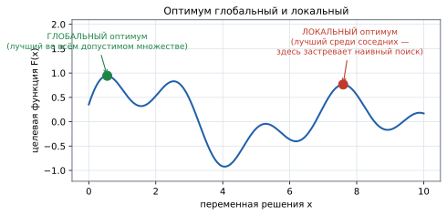

> 📐 **Строго.** `x*` — **глобальный оптимум**, если `F(x*) ≥ F(x)` для всех `x ∈ D`.
> `x°` — **локальный оптимум**, если `F(x°) ≥ F(x)` лишь для `x` из некоторой
> окрестности `x°`.

> 💬 **По-простому.** Глобальный — самая высокая вершина во всей местности.
> Локальный — вершина холма, с которого во все стороны вниз, но есть горы повыше.
> Методы, которые «идут вверх, пока идётся», застревают на локальном и не знают об этом.

Практическое следствие: если метод даёт локальный оптимум, **не существует способа
изнутри метода понять, насколько он хуже глобального**. Именно поэтому так ценны
методы с доказанной гарантией (§6.3) — они дают оценку разрыва, не зная оптимума.

### 1.3. Пример-минимум: задача о рюкзаке

Классическая иллюстрация, на которой видны все четыре элемента.

**Условие.** Рюкзак выдерживает 10 кг. Есть четыре предмета:

| Предмет | Вес, кг | Ценность |
|---|---|---|
| A | 5 | 10 |
| B | 4 | 40 |
| C | 6 | 30 |
| D | 3 | 50 |

> 🧮 **Пример расчёта.**
> * **переменные решения:** `x = (x_A, x_B, x_C, x_D)`, где `x_i ∈ {0, 1}` — берём предмет или нет;
> * **целевая функция:** `F(x) = 10·x_A + 40·x_B + 30·x_C + 50·x_D → max`;
> * **ограничение:** `5·x_A + 4·x_B + 6·x_C + 3·x_D ≤ 10`;
> * **допустимое множество:** все наборы, укладывающиеся в 10 кг.
>
> Перебираем допустимые наборы:
>
> | Набор | Вес | Ценность |
> |---|---|---|
> | B + D | 4 + 3 = 7 | 40 + 50 = **90** ← оптимум |
> | C + D | 6 + 3 = 9 | 30 + 50 = 80 |
> | A + B | 5 + 4 = 9 | 10 + 40 = 50 |
> | A + D | 5 + 3 = 8 | 10 + 50 = 60 |
> | B + C | 4 + 6 = 10 | 40 + 30 = 70 |
>
> Ответ: `x* = (0, 1, 0, 1)`, `max F = 90`.

Здесь перебор из 16 вариантов возможен. В §5.1 показано, почему он перестаёт быть
возможным уже при нескольких тысячах вариантов выбора.

---

## 2. Критерий, показатель и целевая функция — три разные вещи

Раздел ключевой: смешение этих понятий — самая частая ошибка в постановке задачи.

### 2.1. В чём разница

| | **КРИТЕРИЙ** | **ПОКАЗАТЕЛЬ** | **ЦЕЛЕВАЯ ФУНКЦИЯ** |
|---|---|---|---|
| отвечает на вопрос | по чему **выбираем** | что **измеряем** в результате | как критерии **свёрнуты в одно число** |
| участвует в оптимизации | да, определяет выбор | нет, считается после | да, это её техническая форма |
| сколько их бывает | один или несколько | сколько угодно | всегда **одна** |
| пример из нашей задачи | кратность обнаружения; равномерность | средняя кратность; % сопровождения; путь вне зоны; доля маршрутов с ≥ k | `φ = α₁·(кратность) + α₂·(равномерность)` |

> 📐 **Строго.** **Критерий** — величина, по которой ведётся оптимизация; входит в
> целевую функцию и определяет выбор решения. **Показатель** — измеримая
> характеристика результата, служащая для контроля и интерпретации; может не входить
> в целевую функцию. **Целевая функция** — конкретная числовая форма, в которую
> свёрнуты критерии, включая нормировку и веса.

> 💬 **По-простому.** Критерий — то, ради чего вы выбираете. Показатель — то, что вы
> потом докладываете. Целевая функция — формула, по которой машина считает оценку.
> Можно оптимизировать по одному критерию, а докладывать десять показателей.

⚠️ **Ловушка — подмена критерия показателем.** Если показатель начинают
максимизировать напрямую, он перестаёт быть честной мерой качества. Пример из нашей
задачи: показатель «средняя кратность засечек» выглядит разумным, но если сделать его
критерием, оптимум ставит **все датчики в одну точку** самого частого коридора —
средняя кратность максимальна, а половина маршрутов не засечена вовсе. Именно поэтому
критерий содержит **усечение** `min(n, k)`, а средняя кратность осталась показателем.

### 2.2. Требования к критерию

| Требование | Что означает | Что бывает при нарушении |
|---|---|---|
| **измеримость** | выражается числом, а не словами | «удобство расстановки» посчитать нельзя — оптимизировать нечего |
| **согласованность с целью** | рост критерия = улучшение по существу | оптимум формально хорош, практически бесполезен |
| **чувствительность** | реагирует на изменение решения, нет обширных «плато» | на плато все варианты равны, выбор становится случайным |
| **вычислимость** | считается быстро, в том числе многократно | метод не успевает сойтись за приемлемое время |
| **сопоставимость слагаемых** | разнородные части приведены к общей шкале | слагаемое с большими числами подавляет остальные |

⚠️ **Ловушка — «плато».** Реальный случай из этого проекта: когда все критерии
насыщались, прирост становился нулевым сразу у многих кандидатов, и жадный выбор брал
**первого по порядку в массиве** — то есть по сути произвольного. Лечится добавлением
третичного ключа сравнения (§8.3).

### 2.3. Требования к показателю

* **репрезентативность** — отражает существенное свойство результата, а не побочное;
* **устойчивость** — не скачет от случайных мелочей прогона;
* **интерпретируемость** — понятен заказчику без объяснения формулы;
* для величин с асимметричным распределением приводится **медиана**, а не только
  среднее, **с указанием объёма выборки**.

### 2.4. Как критерии превращаются в целевую функцию

Три шага, и все три обязательны.

**Шаг 1 — нормировка.** Каждый критерий приводится к диапазону `[0, 1]`, иначе
сравнивать их нельзя: километры и штуки не складываются.

```
нормированный критерий  =  фактическое значение / максимально возможное
```

**Шаг 2 — насыщение** (если критерий имеет естественный «достаточный» уровень):

```
min(n, k) / k   вместо   n / k
```

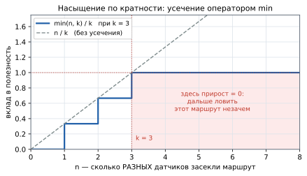

Пунктиром показано, что было бы **без** усечения: `n/k` растёт неограниченно, и
оптимуму выгодно бесконечно усиливать уже обеспеченный маршрут. Усечение обнуляет
прирост после `k` — ресурс переносится туда, где требование ещё не выполнено. Это же
свойство даёт целевой функции субмодулярность (§4.4).

**Шаг 3 — свёртка** нескольких критериев в один:

```
φ = α₁ · критерий₁ + α₂ · критерий₂,      α₁ + α₂ = 1,   α₁, α₂ ≥ 0
```

где `α₁, α₂` — **веса**, задающие относительную важность. Условие `α₁ + α₂ = 1`
удерживает `φ` в диапазоне `[0, 1]`, что делает значения разных прогонов сравнимыми.

> 🧮 **Пример расчёта.** Требуется `k = 3` засечки, маршрут разбит на `L_seg = 10`
> сегментов. Расстановка дала `n = 5` засечек и `m = 4` покрытых сегмента.
> Режим сбалансированный: `α₁ = α₂ = 0.5`.
>
> ```
> кратность:      min(5, 3) / 3 = 3 / 3 = 1.00     ← усечено: 5 засечек, но зачтено 3
> равномерность:  4 / 10        = 0.40
> свёртка:        φ = 0.5 · 1.00 + 0.5 · 0.40 = 0.70
> ```
>
> Качество этой расстановки на этом маршруте — **0.70 из 1.00**. Обратите внимание:
> две «лишние» засечки не дали ничего — в этом весь смысл усечения.

---

## 3. Классы оптимизационных задач

От класса зависит применимый метод — поэтому классификация не формальность.

### 3.1. По типу переменных

| Класс | Переменные | Пример | Чем решают |
|---|---|---|---|
| **непрерывные** | меняются плавно | координата, толщина, температура | градиентные методы, выпуклое программирование |
| **дискретные / комбинаторные** | выбор из конечного набора | какие 15 позиций из 4 436 | перебор, ветви и границы, жадные алгоритмы |
| **смешанные** | и те и другие | разместить и настроить | MILP, декомпозиция |

### 3.2. По структуре целевой функции и ограничений

* **линейные** — `F` и ограничения линейны; решаются симплекс-методом за
  предсказуемое время, размерности в тысячи переменных обычны;
* **нелинейные** — общего эффективного метода нет; ключевую роль играет наличие
  структурных свойств (§4).

### 3.3. По определённости исходных данных

| Класс | Данные | Критерий |
|---|---|---|
| **детерминированные** | известны точно | само значение `F(x)` |
| **стохастические** | часть случайна, задана распределением | **математическое ожидание** `E[F(x, ξ)]` |
| **робастные** | распределение неизвестно, известен диапазон | наихудший случай `min_ξ F(x, ξ)` |

### 3.4. По числу критериев

* **однокритериальные** — одна мера качества;
* **многокритериальные** — несколько, как правило конфликтующих. Решается либо
  свёрткой в один критерий (§2.4), либо построением **множества Парето** — набора
  решений, ни одно из которых не улучшить по одному критерию, не ухудшив по другому.

### 3.5. Куда попадает задача размещения датчиков

Рассматриваемая задача **одновременно**:

* **дискретная** — позиции выбираются из конечной сетки кандидатов;
* **стохастическая** — маршрут случаен, распределение задано неявно;
* **многокритериальная** — кратность и равномерность, свёрнуты весами `α₁, α₂`;
* **нелинейная** — из-за усечения `min(n, k)`;
* **NP-трудная** — принадлежит классу задач максимального покрытия.

Это сочетание и предопределяет метод: **жадный алгоритм поверх выборочного
среднего** (§6, §7). Ни один из элементов сочетания нельзя выбросить: убрать
стохастичность — потеряется суть задачи, убрать дискретность — исчезнет гарантия.

---

## 4. Структурные свойства целевой функции

> **Главная мысль раздела.** Метод решения выбирается **не по предметной области, а по
> структурным свойствам целевой функции**. Одна и та же по смыслу задача решается
> совершенно по-разному в зависимости от того, какими свойствами обладает `F`.

### 4.1. Монотонность

> 📐 **Строго.** Функция множеств `F` **монотонна** (неубывающая), если для любых
> `A ⊆ B` выполнено `F(A) ≤ F(B)`.

> 💬 **По-простому.** Добавление ещё одного датчика не может ухудшить результат.
> Хуже не станет — в худшем случае новый датчик просто ничего не добавит.

### 4.2. Вогнутость

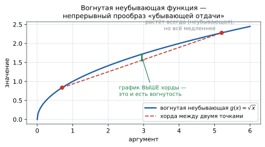

> 📐 **Строго.** Функция `g` **вогнута** на отрезке, если её график лежит не ниже
> хорды: `g(λa + (1−λ)b) ≥ λ·g(a) + (1−λ)·g(b)` для всех `λ ∈ [0, 1]`.
> **Неубывающая** — если `a ≤ b` влечёт `g(a) ≤ g(b)`.

Разбор символов: `a`, `b` — две точки на оси; `λ` («лямбда») — доля, задающая
промежуточную точку между ними; `λa + (1−λ)b` — сама промежуточная точка;
`λ·g(a) + (1−λ)·g(b)` — высота хорды над ней.

> 💬 **По-простому.** «Вогнутая неубывающая» = растёт всегда, но всё медленнее.
> Первая ложка сахара в чае меняет вкус сильно, десятая — почти нет.

Оператор `min(·, k)` — вогнутая неубывающая функция: до `k` растёт с постоянной
скоростью, после `k` перестаёт расти вовсе. Это и есть **техническая причина**, по
которой усечение придаёт целевой функции нужные свойства (§4.4).

### 4.3. Субмодулярность

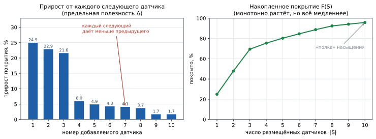

> 📐 **Строго.** Функция множеств `F : 2^C → ℝ` **субмодулярна**, если для любых
> `A ⊆ B ⊆ C` и любого `v ∉ B`:
>
> ```
> F(A ∪ {v}) − F(A)  ≥  F(B ∪ {v}) − F(B)
> ```

Разбор символов:

* `C` — множество всех кандидатов (все возможные позиции);
* `2^C` — множество всех подмножеств `C` (все возможные расстановки);
* `A ⊆ B` — `A` есть часть `B`: «датчиков было мало, стало больше»;
* `v ∉ B` — новый элемент, ещё не выбранный;
* `F(A ∪ {v}) − F(A)` — **предельный прирост** от добавления `v` к `A`.

Для предельного прироста вводят краткое обозначение — **дискретная производная**:

```
Δ(v | A) = F(A ∪ {v}) − F(A)
```

и тогда определение записывается в одну строку:

```
Δ(v | A) ≥ Δ(v | B)      при A ⊆ B
```

> 💬 **По-простому.** Чем больше датчиков уже стоит, тем меньше пользы от следующего.
> Зоны перекрываются, лучшие места заняты, новому датчику остаётся всё меньше
> неохваченного. Это «закон убывающей отдачи», знакомый из экономики.

> 🧮 **Пример расчёта.** Пусть `A = {c₁}`, `B = {c₁, c₃}` (то есть `A ⊆ B`), и мы
> добавляем `c₂`. По рисунку «Жадный алгоритм по шагам» (§6.2):
>
> ```
> Δ(c₂ | A) = прирост c₂ после одного c₁      = 74
> Δ(c₂ | B) = прирост c₂ после c₁ и c₃        = 31
> 74 ≥ 31  ✔  — неравенство субмодулярности выполнено
> ```

### 4.4. Почему функция покрытия субмодулярна — доказательство

Полезно привести в статье: показывает, что гарантия качества не постулируется, а
выводится.

**Утверждение.** Функция `F(S) = |⋃_{c ∈ S} E_c|` — число элементов, покрытых хотя бы
одним выбранным датчиком, — монотонна и субмодулярна.

**Доказательство.**

1. **Монотонность.** Объединение по большему множеству включает объединение по
   меньшему: `A ⊆ B ⟹ ⋃_{c∈A} E_c ⊆ ⋃_{c∈B} E_c ⟹ F(A) ≤ F(B)`. ∎
2. **Субмодулярность.** Прирост от добавления `v` — это элементы `E_v`, которые ещё
   **не покрыты**:

   ```
   Δ(v | A) = | E_v \ ⋃_{c∈A} E_c |
   ```

   Так как `A ⊆ B`, объединение по `A` содержится в объединении по `B`, значит
   вычитается из `E_v` меньшее множество, и остаток больше:

   ```
   E_v \ ⋃_{c∈B} E_c  ⊆  E_v \ ⋃_{c∈A} E_c    ⟹    Δ(v | B) ≤ Δ(v | A)   ∎
   ```

**Дальше — три правила сохранения свойства**, они позволяют собирать сложные функции
из простых, не теряя гарантии:

| Правило | Формулировка | Зачем нужно у нас |
|---|---|---|
| **композиция** | вогнутая неубывающая от модулярной — субмодулярна | `min(n(S,γ), k)`: `n` модулярна, `min(·,k)` вогнута |
| **сумма** | неотрицательная сумма субмодулярных субмодулярна | сложение критериев с весами `α₁, α₂ ≥ 0` |
| **усреднение** | среднее по выборке субмодулярных субмодулярно | `F_t(S) = (1/t)·Σ φ(S, γᵢ)` |

Из этих трёх правил и следует главный вывод: **целевая функция задачи субмодулярна**,
а значит применим жадный алгоритм с гарантией.

⚠️ **Ловушка.** Модулярность (`n(S,γ)` — просто сумма вкладов, независимых друг от
друга) сама по себе гарантии не даёт: для модулярной функции оптимум находится
тривиально, но она не отражает насыщения. Свойство появляется **именно от усечения**
`min(·, k)`. Уберите `min` — и вместе с ним исчезнет смысл распределять датчики.

### 4.5. Сводка: свойство → что оно даёт

| Свойство `F` | Какой метод открывает | Какая гарантия |
|---|---|---|
| линейность | симплекс-метод | точный оптимум |
| выпуклость (на минимум) | градиентные методы | точный оптимум, любой локальный = глобальный |
| **монотонность + субмодулярность** | **жадный алгоритм** | **не хуже (1 − 1/e) ≈ 63.2 % оптимума** |
| никаких свойств | метаэвристики, случайный поиск | **никакой** |

---

## 5. Методы решения

### 5.1. Точные методы

Полный перебор, метод ветвей и границ (branch and bound — отсечение заведомо
неперспективных ветвей), линейное и целочисленное программирование (ILP).

**Гарантия:** глобальный оптимум. **Плата:** трудоёмкость растёт экспоненциально.

> 🧮 **Пример расчёта — почему перебор невозможен.** Число способов выбрать `N`
> позиций из `|C|` кандидатов — число сочетаний:
>
> ```
> C(|C|, N) = |C|! / ( N! · (|C| − N)! )
> ```
>
> При `|C| = 4 436` и `N = 15` это ≈ **10⁴³** вариантов. Даже при триллионе проверок
> в секунду перебор занял бы больше времени, чем существует Вселенная. Для сравнения:
> атомов в наблюдаемой Вселенной ≈ 10⁸⁰.

### 5.2. Жадные и приближённые алгоритмы

Решение строится по шагам; на каждом шаге берётся локально наилучший вариант.

**Плюсы:** быстры, детерминированы, просты. **Минус:** в общем случае гарантий нет —
**но** для функций специальной структуры (§4.3) гарантия доказана.

### 5.3. Метаэвристики

Генетические алгоритмы, метод роя частиц (Particle Swarm Optimization, PSO), имитация
отжига (simulated annealing).

**Плюс:** универсальны, применимы к любой функции. **Минусы:** не дают оценки
близости к оптимуму, требуют настройки параметров, воспроизводимость хуже.

> **Почему в этой работе метаэвристики не применяются.** Не потому, что они плохи, а
> потому, что задача обладает субмодулярностью — а значит доступен метод **с
> доказанной оценкой**. Менять доказанную гарантию на ненаблюдаемое «обычно работает
> хорошо» смысла нет. Это осознанное решение, а не упущение.

### 5.4. Градиентные методы

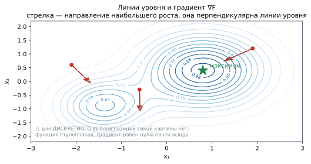

Движение по направлению наибольшего роста `F`. Требуют **непрерывности и
дифференцируемости**.

Работают надёжно при **выпуклом допустимом множестве и вогнутой целевой функции**: там
любой локальный оптимум является глобальным. Что такое выпуклое множество и почему это
так важно — [часть 2 §1.11](2_ГЕОМЕТРИЯ_И_ОБОЗНАЧЕНИЯ.md).

⚠️ **Ловушка.** К задачам дискретного выбора неприменимы в принципе: факт попадания
точки в зону датчика — **ступенчатая** функция положения (0 или 1), её производная
равна нулю почти всюду и не существует в точке скачка. Направления «куда сдвинуть
датчик» градиент не даёт. Обход существует — заменить ступеньку гладкой убывающей с
расстоянием моделью обнаружения, — но это уже другая модель.

### 5.5. Стохастические методы

Метод выборочного среднего (SAA) и стохастическая аппроксимация — подробно в §7.

### 5.6. Как выбрать метод: сводная таблица

| Если задача… | …то метод | Гарантия |
|---|---|---|
| линейная, непрерывная | симплекс | точный оптимум |
| линейная, целочисленная, малой размерности | ILP / ветви и границы | точный оптимум |
| непрерывная, гладкая, выпуклая | градиентный спуск | точный оптимум |
| **дискретная, монотонная, субмодулярная** | **жадный алгоритм** | **(1 − 1/e)** |
| со случайными данными | SAA поверх основного метода | сходимость по вероятности |
| без структуры, размерность велика | метаэвристика | нет |

---

## 6. Связь: от целевой функции к алгоритму и гарантии

Раздел отвечает на вопрос, ради которого пособие и написано: **как критерии,
показатели, целевая функция и алгоритмы связаны между собой** — последовательно, шаг
за шагом.

### 6.1. Цепочка построения решения

```
① ЦЕЛЬ (словами)
   «надёжно засекать аппараты малым числом датчиков»
                    │
                    ▼
② КРИТЕРИИ (что считаем хорошим)         ③ ПОКАЗАТЕЛИ (что докладываем)
   • кратность обнаружения                   • средняя кратность
   • равномерность сопровождения             • % сопровождения пути
                    │                        • путь вне зоны, км
                    │                        • доля маршрутов с ≥ k
                    ▼                          ▲
④ ЦЕЛЕВАЯ ФУНКЦИЯ (свёртка: §2.4)              │ считаются ПОСЛЕ,
   φ = α₁·min(n,k)/k + α₂·m/L_seg              │ на выбор не влияют
                    │                          │
                    ▼                          │
⑤ УЧЁТ СЛУЧАЙНОСТИ (§7)                        │
   F(S) = E[φ(S,Γ)] → F_t(S) = (1/t)·Σφ(S,γᵢ)  │
                    │                          │
                    ▼                          │
⑥ СВОЙСТВА ФУНКЦИИ (§4)                        │
   монотонность + субмодулярность              │
                    │                          │
                    ▼                          │
⑦ ВЫБОР АЛГОРИТМА (§5.6)                       │
   жадный субмодулярный выбор                  │
                    │                          │
                    ▼                          │
⑧ ГАРАНТИЯ (§6.3)                              │
   F(S_greedy) ≥ (1 − 1/e)·F(S*)               │
                    │                          │
                    ▼                          │
⑨ РЕЗУЛЬТАТ: расстановка S ───────────────────►┘
```

**Что читается из этой схемы:**

1. **Алгоритм не выбирают первым.** Он определяется на шаге ⑦ — после того, как
   выяснены свойства функции на шаге ⑥. Выбор алгоритма «потому что он популярный» —
   это работа с середины, и гарантию так получить нельзя.
2. **Свойства функции определяются её конструкцией.** Усечение `min(·,k)`, введённое
   на шаге ④ по содержательным соображениям, дало на шаге ⑥ субмодулярность, а она на
   шаге ⑧ — гарантию. Содержательное решение обернулось математическим свойством.
3. **Показатели — боковая ветвь.** Они не участвуют в выборе (стрелка идёт только
   вправо и вверх, к отчёту), и это принципиально: показатель, попавший в целевую
   функцию, перестаёт быть независимой мерой контроля.

### 6.2. Жадный алгоритм: как он работает

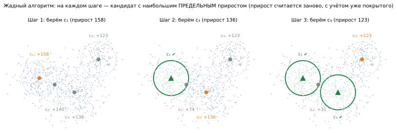

> 📐 **Строго.** Алгоритм начинает с пустого множества `S₀ = ∅` и на каждом шаге
> `i = 1 … N` добавляет элемент с максимальным предельным приростом:
>
> ```
> v_i = argmax  Δ(v | S_{i−1}),      v ∈ C \ S_{i−1}
> S_i = S_{i−1} ∪ {v_i}
> ```

Разбор: `C \ S` — «`C` без `S`», то есть ещё не выбранные кандидаты;
`Δ(v | S)` — прирост от `v` при уже выбранных `S` (§4.3).

> 💬 **По-простому.** На каждом шаге берём то, что прямо сейчас даёт больше всего
> нового. Ключевое слово — **нового**: прирост считается заново на каждом шаге, с
> учётом уже покрытого. Кандидат, который был вторым по силе, после первого выбора
> может стать десятым, если его зона перекрылась.

**Именно это видно на рисунке:** кандидат `c₂` изолированно давал 140 (второй
результат), но после выбора `c₁` его прирост упал до 74, и алгоритм предпочёл `c₃`
со 136. Наивная стратегия «отсортировать кандидатов по силе и взять первые N» дала бы
худший результат — она игнорирует перекрытие.

**Вычислительная сложность:** `O(N · |C|)` вычислений прироста против `C(|C|, N)`
вариантов у перебора. Для наших чисел — около 66 тысяч операций вместо 10⁴³.

### 6.3. Гарантия качества

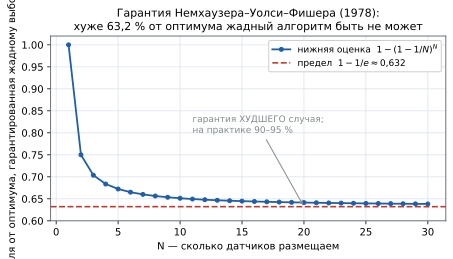

> 📐 **Строго** (Nemhauser, Wolsey, Fisher, 1978). Пусть `F` — монотонная
> субмодулярная функция с `F(∅) = 0`, а `S*` — оптимальное решение задачи
> `max F(S)` при `|S| ≤ N`. Тогда жадное решение `S_greedy` удовлетворяет:
>
> ```
> F(S_greedy)  ≥  (1 − (1 − 1/N)^N) · F(S*)  ≥  (1 − 1/e) · F(S*) ≈ 0.632 · F(S*)
> ```

Разбор: `e ≈ 2.71828` — основание натурального логарифма; `1 − 1/e ≈ 0.632`.
Величина `(1 − 1/N)^N` монотонно убывает к `1/e` — отсюда и предел (см. рисунок).

> 💬 **По-простому.** Как бы неудачно ни сложились обстоятельства, жадный выбор даст
> не меньше 63 % от того, что дал бы недостижимый идеальный перебор. Это **гарантия
> худшего случая**: на практике жадный алгоритм обычно даёт 90–95 % от оптимума.

**Почему это главный аргумент работы.** Утверждение «наш алгоритм хорош» обычно
недоказуемо: оптимум неизвестен, сравнивать не с чем. Здесь же есть **нижняя оценка,
не требующая знания оптимума**. Ни PSO, ни генетический алгоритм такого не дают.

### 6.4. Откуда берётся 1 − 1/e (набросок доказательства)

Для статьи достаточно трёх шагов; полное доказательство — в первоисточнике.

1. **Оценка через оптимум.** Из монотонности и субмодулярности для любого шага `i`:

   ```
   F(S*) ≤ F(S_i) + Σ_{v ∈ S*} Δ(v | S_i)
   ```

   (значение оптимума не больше текущего плюс приросты всех его элементов).

2. **Жадный шаг — не хуже среднего.** В `S*` ровно `N` элементов, а жадный алгоритм
   берёт лучший из всех, значит его прирост не меньше среднего по `S*`:

   ```
   F(S_{i+1}) − F(S_i)  ≥  (1/N) · ( F(S*) − F(S_i) )
   ```

3. **Рекурсия.** Обозначив «недобор» `δ_i = F(S*) − F(S_i)`, получаем
   `δ_{i+1} ≤ (1 − 1/N) · δ_i`, откуда за `N` шагов `δ_N ≤ (1 − 1/N)^N · δ_0`.
   Так как `(1 − 1/N)^N → 1/e`, недобор не превышает `1/e` доли, а достигнутое —
   не меньше `(1 − 1/e)`. ∎

### 6.5. Полный численный пример жадного прогона

> 🧮 **Пример расчёта.** Ставим `N = 3` датчика из четырёх кандидатов. Целевая
> функция — процент перехваченных маршрутов. Изолированная полезность каждого:
> `f(c₁) = 40`, `f(c₂) = 20`, `f(c₃) = 10`, `f(c₄) = 25`.
>
> **Шаг 1.** `S₀ = ∅`. Приросты равны изолированным значениям:
> ```
> Δ(c₁|∅)=40   Δ(c₂|∅)=20   Δ(c₃|∅)=10   Δ(c₄|∅)=25
> ```
> Максимум у `c₁`. → `S₁ = {c₁}`, `F(S₁) = 40`.
>
> **Шаг 2.** Пересчитываем приросты **с учётом перекрытия** с `c₁`:
> ```
> Δ(c₂|S₁) = f(c₁∪c₂) − f(c₁) = 45 − 40 =  5    (зоны сильно перекрылись)
> Δ(c₃|S₁) = f(c₁∪c₃) − f(c₁) = 70 − 40 = 30    (зоны не перекрываются)
> Δ(c₄|S₁) = f(c₁∪c₄) − f(c₁) = 55 − 40 = 15
> ```
> Максимум у `c₃`. → `S₂ = {c₁, c₃}`, `F(S₂) = 70`.
>
> **Обратите внимание:** изолированно `c₂` был вдвое сильнее `c₃` (20 против 10), но
> в паре с `c₁` оказался в шесть раз слабее (5 против 30) — он дублировал уже
> покрытое. Это и есть работа субмодулярности.
>
> **Шаг 3.**
> ```
> Δ(c₂|S₂) = 73 − 70 = 3      Δ(c₄|S₂) = 80 − 70 = 10
> ```
> Максимум у `c₄`. → `S₃ = {c₁, c₃, c₄}`, `F(S₃) = **80**`.
>
> **Проверка гарантии.** Полный перебор дал бы для этого примера оптимум `F(S*) = 85`.
> Тогда `F(S₃) / F(S*) = 80 / 85 = 0.94` — то есть 94 % от оптимума при
> гарантированных 63 %. Типичный результат: гарантия консервативна.

⚠️ **Важная оговорка о применимости.** Теорема требует, чтобы ограничение было ровно
«взять не более `N` элементов». Как только сверху добавляются другие правила —
принудительные элементы («поставь датчик обязательно сюда»), запрет ставить два объекта
ближе `d` друг к другу, предварительный отсев кандидатов — задача выходит из условий
теоремы, и гарантия перестаёт действовать **формально**, даже если результат на практике
остаётся хорошим. Это не мелочь: например, «попарно не ближе `d`» не является матроидом,
а для матроидных ограничений жадный даёт уже 1/2 вместо 0.632.

В нашей программе так и оказалось — разбор с числами и способ вернуть обоснованность:
[планы/6_ПОПРАВКИ_В_МОДЕЛЬ_ДАТЧИКОВ.md](../планы/6_ПОПРАВКИ_В_МОДЕЛЬ_ДАТЧИКОВ.md).
Там же — как измерять **апостериорный** зазор до оптимума: он не зависит от того,
выполняются ли предпосылки теоремы, и обычно даёт куда более сильное утверждение.

---

## 7. Случайность в оптимизации: вероятность, матожидание, риск

Раздел общий: он о том, что делать, когда часть данных задачи случайна. Приложение к
размещению датчиков — частный случай.

### 7.1. Откуда берётся случайность и почему её нельзя игнорировать

Три типовых источника, и они требуют разного обращения:

| Источник | Пример | Что с ним делают |
|---|---|---|
| **неизвестное поведение** | маршрут аппарата, спрос на товар | задают распределением, оптимизируют средний исход |
| **погрешность измерения** | ошибка датчика, неточность карты | закладывают запас, проверяют устойчивость решения |
| **редкое событие** | отказ оборудования, шторм | выносят в отдельное ограничение по вероятности |

⚠️ **Соблазн заменить случайность средним значением.** Часто рассуждают так: «маршрут
неизвестен — возьмём средний маршрут и под него оптимизируем». Это ошибка, у неё есть
имя — **ошибка плоского среднего** (flaw of averages): оптимум для среднего сценария и
средний результат по всем сценариям — разные вещи.

> 🧮 **Пример.** Аппарат с равной вероятностью летит северным или южным коридором.
> «Средний маршрут» проходит ровно между ними. Датчик, поставленный на этот средний
> маршрут, не ловит **ни один** из двух реальных.

Формально: `F(𝔼[Γ]) ≠ 𝔼[F(Γ)]`. Оптимизировать нужно **второе** — среднее от исходов,
а не исход от среднего.

### 7.2. Случайная величина и распределение

> 📐 **Строго.** Случайная величина `X` — функция, сопоставляющая каждому исходу число.
> Её поведение полностью описывается **распределением**: для непрерывной величины —
> плотностью `p(x)`, для дискретной — набором вероятностей `ℙ(X = xᵢ)`.

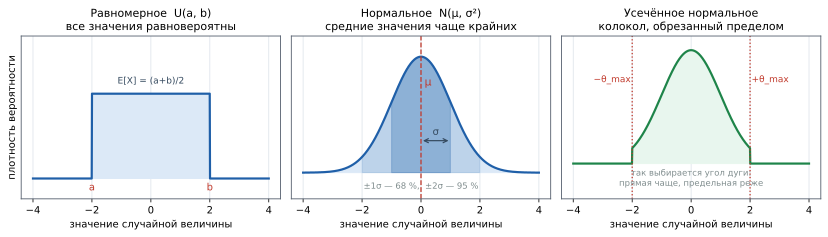

**Три закона, которых хватает в большинстве прикладных моделей:**

| Закон | Запись | Когда применяют | Где в этой работе |
|---|---|---|---|
| **равномерный** | `X ~ U(a, b)` | «известны только границы, предпочтений нет» | точка старта внутри зоны; выбор угла в режиме «средний» |
| **нормальный** | `X ~ N(μ, σ²)` | сумма многих мелких независимых влияний | базовый для отклонений |
| **усечённый нормальный** | `N(μ, σ²)` на `[a, b]` | то же, но значение физически ограничено | угол дуги: колокол, обрезанный `±θ_max` |

⚠️ **Почему усечение обязательно.** Нормальное распределение формально допускает любые
значения, в том числе угол, при котором длина маршрута превысит запас хода. Обрезание
пределом — не косметика, а способ не породить физически невозможный сценарий.

**Ещё два закона, встречающихся постоянно** (в этой работе не используются, но в
литературе рядом): **экспоненциальный** `Exp(λ)` — время до отказа, интервалы между
событиями; **пуассоновский** `Pois(λ)` — число событий за период.

### 7.3. Математическое ожидание и дисперсия

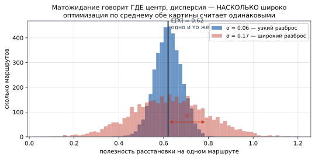

> 📐 **Строго.**
> ```
> 𝔼[X] = Σ xᵢ · ℙ(X = xᵢ)        (дискретная)
> 𝔼[X] = ∫ x · p(x) dx           (непрерывная)
> 𝔻[X] = 𝔼[ (X − 𝔼[X])² ] = 𝔼[X²] − (𝔼[X])²
> σ = √𝔻[X]
> ```

**Разбор:** `𝔼[X]` — **математическое ожидание**, центр распределения, «среднее с
учётом вероятностей». `𝔻[X]` (или `Var[X]`) — **дисперсия**, средний квадрат
отклонения от центра. `σ` — **среднеквадратичное отклонение**, тот же разброс, но в
единицах самой величины, поэтому в отчёт идёт обычно оно.

> 💬 **По-простому.** Матожидание — где находится центр тяжести распределения.
> Дисперсия — насколько широко оно размазано вокруг центра.

**Свойства, которыми пользуются при выводе формул:**

```
𝔼[aX + b] = a·𝔼[X] + b            линейность — работает ВСЕГДА
𝔼[X + Y] = 𝔼[X] + 𝔼[Y]           тоже всегда, даже для зависимых X и Y
𝔻[aX] = a²·𝔻[X]                   квадрат: множитель выходит в квадрате
𝔻[X + Y] = 𝔻[X] + 𝔻[Y]           ⚠️ ТОЛЬКО для независимых
```

⚠️ **Ключевое следствие для оптимизации.** Матожидание **линейно**, а значит
`𝔼[Σ φᵢ] = Σ 𝔼[φᵢ]` — среднее суммы равно сумме средних. Именно поэтому усреднение по
выборке **сохраняет субмодулярность** целевой функции (§4.4): среднее субмодулярных
функций субмодулярно. Без линейности матожидания вся конструкция с гарантией
развалилась бы.

### 7.4. Законы больших чисел и центральная предельная теорема

Два утверждения, на которых держится вся выборочная оценка.

> 📐 **Усиленный закон больших чисел (ЗБЧ).** Если `X₁, X₂, …` независимы, одинаково
> распределены и `𝔼[X]` существует, то выборочное среднее сходится к нему почти
> наверное:
> ```
> (1/t)·Σ_{i=1..t} Xᵢ  →  𝔼[X]     при t → ∞
> ```

> 📐 **Центральная предельная теорема (ЦПТ).** Отклонение выборочного среднего от
> истинного при больших `t` распределено приблизительно нормально:
> ```
> (среднее по выборке − 𝔼[X])  ≈  N(0, σ²/t)
> ```

**Что из них следует практически:**

* **ЗБЧ отвечает «сойдётся ли»** — да, сойдётся, если выборка независима и одинаково
  распределена;
* **ЦПТ отвечает «насколько мы уже близко»** — разброс оценки равен `σ/√t`, и это даёт
  доверительный интервал, то есть **численную меру доверия к результату прогона**.

⚠️ **Требование i.i.d. — не формальность.** Если сценарии в выборке зависимы (например,
каждый следующий маршрут строится с оглядкой на предыдущий), оценка смещается, а
доверительный интервал по формуле `σ/√t` становится слишком оптимистичным.

### 7.5. Скорость сходимости: закон корня

Из ЦПТ следует правило, которое стоит помнить наизусть:

```
точность растёт как  1/√t          →  вчетверо больше выборки = вдвое точнее
```

| Хотим уменьшить разброс | Во сколько раз растёт выборка |
|---|---|
| вдвое | ×4 |
| впятеро | ×25 |
| вдесятеро | ×100 |

Отсюда **экономический смысл выбора размера выборки**: первые сотни сценариев дают
основную точность, дальнейшее наращивание окупается плохо. Именно это соображение, а не
вкус, стоит за значениями `T = 400` (вкладки 1–2) и 150 итераций (вкладка 3).

### 7.6. В чём проблема

Когда часть данных случайна, само значение `F(x)` — тоже случайная величина.
Оптимизировать случайную величину нельзя: у неё нет одного значения. Поэтому критерием
берут **математическое ожидание**:

```
F(S) = E_Γ[ φ(S, Γ) ] → max
```

Разбор символов:

* `Γ` («гамма» прописная) — случайный маршрут как **случайная величина**;
* `γ` («гамма» строчная) — конкретная **реализация**, один выпавший маршрут;
* `E_Γ[·]` — математическое ожидание по распределению `Γ`, то есть среднее значение
  с учётом вероятностей;
* `φ(S, γ)` — полезность расстановки `S` на маршруте `γ`.

**Препятствие:** распределение `Γ` в явном виде **неизвестно**. Оно задано неявно —
алгоритмом порождения маршрутов, зависящим от геометрии, физики полёта и профиля
разброса. Формулы для `E[φ]` не существует, интеграл по пространству всех кривых
аналитически не берётся.

### 7.7. Решение: заменить ожидание средним по выборке

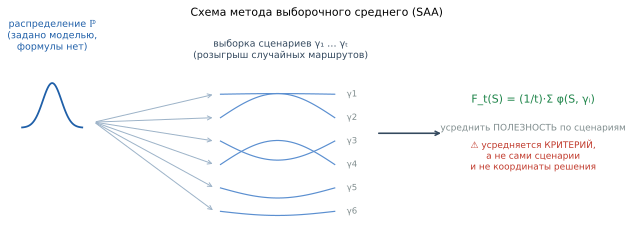

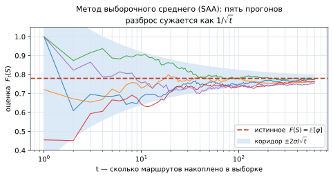

> 📐 **Строго.** Метод выборочного среднего (Sample Average Approximation, SAA):
> порождается выборка `γ₁ … γ_t` независимых одинаково распределённых реализаций, и
> математическое ожидание заменяется эмпирическим средним:
>
> ```
> F_t(S) = (1/t) · Σ_{i=1..t} φ(S, γᵢ)  →  max,      S_t = argmax F_t(S)
> ```

> 💬 **По-простому.** Истинное среднее по бесконечному числу маршрутов недоступно —
> берём среднее по тем, что уже видели, и уточняем с каждым новым.

### 7.8. Сходимость: сколько выборки достаточно

**Обоснование метода** — усиленный закон больших чисел: при `t → ∞` имеем `F_t → F`
почти наверное, а вместе с этим `S_t → S*`.

Скорость сходимости — `1/√t`: чтобы уменьшить разброс оценки **вдвое**, выборку надо
увеличить **вчетверо**. На рисунке это видно по сужающемуся коридору `±2σ/√t`.

> 🧮 **Пример расчёта.** Пусть разброс полезности по маршрутам `σ = 0.22`.
> Полуширина 95 %-го доверительного интервала оценки — `2σ/√t`:
>
> | `t` | `2σ/√t` | смысл |
> |---|---|---|
> | 10 | 0.139 | оценка ±14 % — по ней решать нельзя |
> | 100 | 0.044 | ±4 %, картина уже устойчива |
> | 400 | 0.022 | ±2 %, рабочий режим вкладок 1–2 |
> | 1000 | 0.014 | ±1.4 %, структура практически стабильна |
>
> Отсюда и берутся рабочие значения: `T = 400` для вкладок 1–2 и порядка 150–1000
> итераций в разных режимах — дальше выигрыш в точности не окупает времени счёта.

### 7.9. Что именно усредняется — самая частая ошибка

⚠️ **Ловушка.** Усредняются **не маршруты и не координаты датчиков, а критерий**.

На каждой итерации заново решается задача: куда поставить все `N` датчиков, чтобы
максимизировать среднюю полезность **по всем накопленным маршрутам сразу**. Берётся
не «средний маршрут из ста», а оптимум по всей выборке.

**Почему осреднять координаты недопустимо.** Пусть два хороших расположения: одно
прикрывает левый край сектора, другое — правый. Среднее их координат — центр, где не
прикрыт **ни один** край. Среднее двух хороших решений бывает плохим; среднее
критерия — всегда корректная величина.

**Второе следствие:** число датчиков `N` **фиксировано** — это заданный ресурс. Оно
не растёт с выборкой. Представление «после 10 итераций — 1 датчик, после 50 — 2»
ошибочно: с ростом выборки уточняется **оценка**, а не количество.

### 7.10. Инкрементальная схема

Расстановка пересчитывается по мере накопления: маршрут добавляется в выборку, и
задача решается заново на всей накопленной выборке. Структура эволюционирует и
стабилизируется — это то, что видно в итеративном режиме программы.

### 7.11. Не только среднее: другие критерии при случайности

Матожидание — самый частый, но далеко не единственный ответ на вопрос «насколько
хорошо решение при случайных данных». Выбор критерия меняет ответ сильнее, чем выбор
алгоритма.

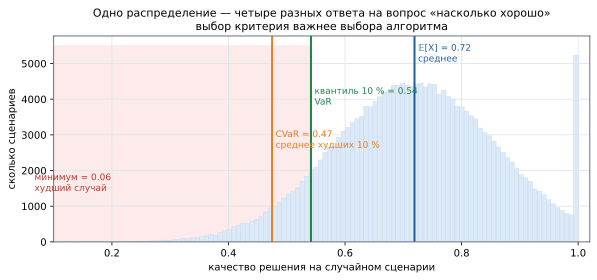

| Критерий | Запись | Что означает | Когда применяют |
|---|---|---|---|
| **среднее** | `𝔼[X] → max` | средний исход по всем сценариям | массовые повторяющиеся ситуации |
| **квантиль** (VaR) | `q_α → max` | уровень, который превышается с вероятностью `1−α` | «гарантия в 90 % случаев» |
| **CVaR** | `𝔼[X \| X ≤ q_α] → max` | среднее по **худшим** `α` сценариям | когда важен характер провалов |
| **худший случай** | `min_γ X → max` | минимакс: гарантия при любом сценарии | нет права на отказ |
| **дисперсия** | `𝔼[X] − λ·𝔻[X] → max` | среднее со штрафом за разброс | нужна предсказуемость |

> 💬 **По-простому.** Среднее говорит «обычно будет так». Квантиль — «в девяти случаях
> из десяти будет не хуже, чем так». CVaR — «а когда всё-таки не повезёт, будет вот
> настолько плохо». Худший случай — «хуже этого не будет никогда».

⚠️ **Среднее слепо к провалам.** Два решения с одинаковым `𝔼` могут вести себя
совершенно по-разному: одно стабильно даёт 0.72, другое — то 0.95, то 0.30. Для
задачи мониторинга это разные вещи, но критерий «максимум среднего» их не различает
(см. рисунок в §7.3, где оба распределения имеют одно и то же матожидание).

**CVaR ценен ещё и технически:** в отличие от квантиля, он сохраняет выпуклость задачи,
поэтому его можно оптимизировать теми же методами, что и среднее.

### 7.12. Вероятностные ограничения

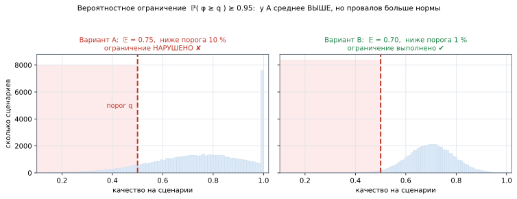

Когда требуется не «в среднем хорошо», а «плохо — редко», условие записывают как
**вероятностное ограничение** (chance constraint):

```
ℙ( φ(S, Γ) ≥ q )  ≥  1 − ε
```

**Разбор:** `q` — требуемый порог качества; `ε` — допустимый уровень риска (например
0.05); всё вместе — «вероятность того, что качество окажется не ниже порога, должна
быть не менее 95 %».

В выборочной форме вероятность заменяется частотой через индикатор:

```
(1/t) · Σ_{i=1..t} 𝟙[ φ(S, γᵢ) ≥ q ]  ≥  1 − ε
```

> 🧮 **Пример расчёта.** Порог `q = 0.6`, риск `ε = 0.2`, выборка из пяти сценариев с
> полезностями `0.9, 0.7, 0.0, 0.8, 0.65`.
> ```
> индикаторы:  1,  1,  0,  1,  1     →  сумма 4
> частота:     4 / 5 = 0.8
> требуется:   ≥ 1 − 0.2 = 0.8       →  0.8 ≥ 0.8  ✔ ограничение выполнено
> ```
> Убери один удачный сценарий — и конфигурация бракуется, при том что среднее
> (0.61) почти не изменится.

⚠️ **Цена такой постановки.** Индикатор — разрывная функция: она скачком меняется с 0
на 1. Производной у неё нет, выпуклость теряется, и привычные методы перестают
работать. Поэтому вероятностные ограничения решают либо сглаживанием (заменой
индикатора гладкой функцией), либо комбинаторно, либо через CVaR как выпуклую
аппроксимацию.

### 7.13. Робастная оптимизация: когда неизвестно даже распределение

SAA предполагает, что распределение сценариев **известно** — хотя бы через возможность
их разыгрывать. Если и оно под сомнением, применяют робастную постановку: оптимизируют
худший случай по целому **семейству** допустимых распределений `𝒫`:

```
max_S  min_{ℙ ∈ 𝒫}  𝔼_ℙ[ φ(S, Γ) ]
```

Читается: «выбрать расстановку, которая хороша даже при самом неблагоприятном из
правдоподобных распределений».

| Подход | Что известно | Что даёт |
|---|---|---|
| детерминированный | точные данные | оптимум для одного сценария |
| **SAA** | распределение (можно разыграть) | оптимум среднего, сходимость по ЗБЧ |
| **робастный** | только семейство распределений | защита от ошибки в модели, ценой осторожности |
| игровой (минимакс) | противник активно мешает | защита от осознанного противодействия |

⚠️ **Робастность не бесплатна.** Решение, защищённое от худшего случая, обычно
заметно хуже в типичном. Прежде чем платить эту цену, стоит убедиться, что худший
случай действительно возможен, а не выдуман.

### 7.14. Сводка: какой критерий выбрать

| Если… | Критерий |
|---|---|
| ситуация повторяется много раз, важен суммарный итог | среднее `𝔼[X]` |
| нужна гарантия «в N % случаев не хуже» | квантиль / вероятностное ограничение |
| важно, насколько плохо бывает в неудачных случаях | CVaR |
| отказ недопустим ни при каких условиях | худший случай (минимакс) |
| важна предсказуемость результата | среднее со штрафом за дисперсию |
| распределение само под сомнением | робастная постановка |

**В этой работе выбран критерий среднего** — потому что задача мониторинга массовая и
повторяющаяся, а провал на одном маршруте не катастрофичен. Выбор оговаривается явно:
это допущение, а не единственно возможный вариант.

---

## 8. Многокритериальность

### 8.1. Конфликт критериев

Два критерия конфликтуют, если улучшение одного ухудшает другой. В нашей задаче:

* **кратность** тянет датчики **вместе** — чтобы один маршрут засекли несколько раз;
* **равномерность** тянет их **врозь** — чтобы покрыть весь путь.

Решения, которые нельзя улучшить по одному критерию, не ухудшив по другому, образуют
**множество Парето**. Выбор одной точки на нём — вопрос не математики, а
предпочтений заказчика; в программе он сделан весами `α₁, α₂`.

### 8.2. Веса как способ выбора точки на границе Парето

| Режим | `α₁` (кратность) | `α₂` (равномерность) | Когда применяется |
|---|---|---|---|
| распределение | 0.25 | 0.75 | важно вести аппарат по всему пути |
| пересечение | 0.75 | 0.25 | важна надёжность самого факта засечки |
| сбалансированный | 0.50 | 0.50 | компромисс, значение по умолчанию |

⚠️ **Ловушка.** Веса имеют смысл **только после нормировки** (§2.4). Если один
критерий измеряется в километрах (десятки), а другой — в долях (0…1), то вес 0.5 не
означает равной важности: слагаемое с большими числами подавит второе полностью.

### 8.3. Лексикографический порядок

Альтернатива свёртке: критерии упорядочиваются по важности и сравниваются
последовательно — сначала по первому, и **лишь при равенстве** по второму.

> 💬 **По-простому.** Как в спортивной таблице: сначала по очкам, при равенстве — по
> разнице мячей, при равенстве и там — по личным встречам.

Приём применён в программе: когда основной критерий насыщается и приросты у многих
кандидатов равны нулю (то самое «плато» из §2.2), включается вторичный критерий
распределения, и оставшиеся датчики разносятся по самым частым путям вместо того,
чтобы выбор стал произвольным. При положительном основном приросте поведение не
меняется — значит, свойства решения сохраняются.

---

## 9. Как записывают постановку задачи

Раздел справочный: канонические формы, принятые в отечественных научных изданиях.
Полезен, когда постановку нужно не понять, а **написать**.

### 9.1. Двухуровневая схема

Постановка всегда даётся в два уровня, и порядок обязателен:

1. **Содержательная (вербальная) постановка** — словесное описание объекта, условий,
   исходных данных, искомого и критерия. Обозначения здесь **не вводятся**;
2. **Формализованная (математическая) постановка** — запись в обозначениях с полной
   расшифровкой «где … — …». Вводится связкой «Формально задача представляется в
   следующем виде».

Дальше по тексту введённые обозначения используются без повторных определений.

### 9.2. Шаблоны вербальной постановки

| Шаблон | Схема | Когда применяют |
|---|---|---|
| **«Дано — Найти»** | контекст → *Дано:* известные величины → *Найти:* искомое при ограничениях | аналитические модели |
| **«Дано — Требуется — Ограничения»** | перечень исходных → *Требуется:* построить … → *Ограничения:* … | алгоритмические задачи |
| **«Пусть задан … Требуется найти …»** | объект в дискретной форме → показатели → искомый вектор | сигнальные и численные задачи |
| **«Прямая и обратная»** | максимум эффекта при заданном ресурсе ↔ минимум ресурса при заданном эффекте | полный охват прикладной проблемы |
| **«Объект — Среда — Ограничения — Допущения — Цель»** | наиболее полный: ограничения нумерованным перечнем по смыслу, допущения отдельным абзацем | физически детализированные модели |

⚠️ **Ограничение и допущение — разные вещи**, их регулярно путают:

* **ограничение** — требование к *решению* (`|S| = N`, датчик не на воде);
* **допущение** — упрощение самой *модели*, которое в общем случае неточно, но принято
  ради разрешимости (плоская геометрия, бинарное обнаружение).

Явный перечень допущений — признак добросовестной постановки; его отсутствие
рецензент замечает первым.

### 9.3. Канонические формы математической записи

**Ф1. Скалярная оптимизация с ограничениями** — базовая форма:

```
S* = arg extr_{S ∈ S_доп} W(S, U),        S_доп = { S : g_k(S) ≤ g_k^доп, k = 1..K }
```

где `S` — вариант решения; `U` — условия среды; `W` — показатель эффективности;
`g_k` — ресурсные и качественные ограничения.

**Ф2. Многокритериальная задача со взвешенной свёрткой** — то, что применено в этой
работе:

```
F(P) = Σ_j α_j · F_j(P),      Σ_j α_j = 1,      P* = arg max_{P ∈ P°} F(P)
```

Метод принято называть в тексте явно: «применяется метод взвешенной суммы».
⚠️ Обязательно указывать **ограничение метода**: скалярная свёртка не гарантирует
Парето-оптимальности при невыпуклой границе допустимых решений и чувствительна к
выбору весов.

**Ф3. Поиск множества рациональных решений** — когда решений несколько:

```
Ξ* = Arg max_{ξ ∈ Ξ_доп} F(ξ)
```

Прописная `Arg` (в отличие от `arg`) означает, что ищется **множество**, а не
единственная точка.

**Ф4. Минимизация риска при двойном ограничении:**

```
X* = arg min R(X)      при      R(X) ≤ R_max,   C(X) ≤ C_max
```

**Ф5. Стохастическая постановка** — форма, применённая здесь:

```
S* = arg max_{|S| = N}  𝔼_Γ[ φ(S, Γ) ]     →     S_t = arg max (1/t)·Σ φ(S, γᵢ)
```

### 9.4. Порядок вывода постановки — шесть шагов

1. **Объект и управляемые переменные** — чем распоряжается исследователь;
2. **Условия и неуправляемые факторы** — среда, законы распределения, требования;
3. **Показатель эффективности** — измеримая величина, связывающая переменные с целью;
   каждый показатель вводится отдельной нумерованной формулой;
4. **Критерий** — оптимальности (`extr W`), пригодности (`W ≥ W_тр`) либо компромиссный
   (свёртка / Парето). Направление указывается явно;
5. **Ограничения**, при большом числе — нумерованным перечнем по физическому смыслу;
   **допущения** — отдельным абзацем после них;
6. **Каноническая запись + расшифровка** «где … — …» столбиком, далее — фраза о методе
   решения.

**Контроль корректности постановки:**

- [ ] каждая величина формулы определена в «Дано» либо в расшифровке;
- [ ] критерий и ограничения не дублируют друг друга;
- [ ] искомое из «Найти» совпадает с аргументом `arg extr`;
- [ ] размерности согласованы;
- [ ] указано, чем гарантируется существование решения (конечность множества,
      монотонность, компактность области).

---

## 10. Словарь терминов

| Термин | Английский | Значение одной фразой |
|---|---|---|
| переменные решения | decision variables | то, что подбираем |
| целевая функция | objective function | формула оценки варианта |
| допустимое множество | feasible set | что разрешено ограничениями |
| критерий | criterion | по чему выбираем |
| показатель | metric / indicator | что измеряем в результате |
| оптимум глобальный | global optimum | лучший во всём множестве |
| оптимум локальный | local optimum | лучший среди соседних |
| монотонность | monotonicity | добавление не ухудшает |
| вогнутость | concavity | график не ниже хорды; рост замедляется |
| субмодулярность | submodularity | убывающая отдача на множествах |
| модулярность | modularity | вклады элементов независимы, просто складываются |
| предельный прирост | marginal gain | насколько вырастет `F` от одного добавления |
| жадный алгоритм | greedy algorithm | на каждом шаге — лучшее прямо сейчас |
| метод выборочного среднего | Sample Average Approximation, SAA | ожидание заменяется средним по выборке |
| закон больших чисел | law of large numbers | среднее по выборке сходится к истинному |
| множество Парето | Pareto set | решения, не улучшаемые без ухудшения |
| лексикографический порядок | lexicographic order | сравнение по старшему критерию, при равенстве — по следующему |
| NP-трудная задача | NP-hard | точное решение неподъёмно при росте размерности |
| задача максимального покрытия | maximum coverage problem | выбрать `N` множеств, покрыв максимум элементов |
| барьерное покрытие кратности k | k-barrier coverage | каждый пересекающий объект замечен ≥ `k` датчиками |
| случайная величина | random variable | число, зависящее от исхода |
| распределение | distribution | какие значения насколько вероятны |
| математическое ожидание | expectation | центр распределения, среднее с учётом вероятностей |
| дисперсия | variance | средний квадрат отклонения от центра |
| среднеквадратичное отклонение | standard deviation | `√дисперсии`, разброс в единицах величины |
| закон больших чисел | law of large numbers | среднее по выборке сходится к истинному |
| центральная предельная теорема | central limit theorem | отклонение среднего распределено нормально, разброс `σ/√t` |
| квантиль | quantile | значение, ниже которого лежит заданная доля наблюдений |
| VaR | value at risk | квантиль как мера риска |
| CVaR | conditional value at risk | среднее по худшим `α` сценариям |
| вероятностное ограничение | chance constraint | «плохо бывает не чаще, чем в `ε` случаев» |
| робастная оптимизация | robust optimization | оптимум при худшем из правдоподобных распределений |
| индикатор | indicator function | 1, если условие верно; иначе 0 |
| независимые одинаково распределённые | i.i.d. | требование к корректной выборке |
| выпуклое множество | convex set | отрезок между любыми точками не выходит наружу |
| градиент | gradient | вектор направления наибольшего роста функции |

---

## 11. Источники

1. **Nemhauser G. L., Wolsey L. A., Fisher M. L.** An Analysis of Approximations for
   Maximizing Submodular Set Functions — I // Mathematical Programming. 1978. Vol. 14,
   № 1. P. 265–294. — *гарантия (1 − 1/e), §6.3.*
2. **Kumar S., Lai T. H., Arora A.** Barrier Coverage with Wireless Sensors //
   Wireless Networks. 2007. Vol. 13, № 6. P. 817–834. — *класс задачи.*
3. **Church R., ReVelle C.** The Maximal Covering Location Problem // Papers in
   Regional Science. 1974. Vol. 32, № 1. P. 101–118. — *дискретная постановка покрытия.*
4. **Shapiro A., Dentcheva D., Ruszczyński A.** Lectures on Stochastic Programming.
   SIAM, 2009. — *метод выборочного среднего, §7.*
5. **Robbins H., Monro S.** A Stochastic Approximation Method // Annals of
   Mathematical Statistics. 1951. Vol. 22, № 3. P. 400–407. — *рекурсивная альтернатива SAA.*
6. **Krause A., Golovin D.** Submodular Function Maximization // Tractability:
   Practical Approaches to Hard Problems. Cambridge University Press, 2014. —
   *обзор свойств и правил сохранения субмодулярности, §4.4.*
7. **Taha H.** Введение в исследование операций. — *классы задач и методы, §3, §5.*
8. **Hillier F., Lieberman G.** Introduction to Operations Research. — *общая теория.*
9. **Rockafellar R. T., Uryasev S.** Optimization of Conditional Value-at-Risk //
   Journal of Risk. 2000. Vol. 2, № 3. P. 21–41. — *CVaR как выпуклая мера риска, §7.11.*
10. **Ben-Tal A., El Ghaoui L., Nemirovski A.** Robust Optimization. Princeton
    University Press, 2009. — *робастная постановка, §7.13.*
11. **Birge J., Louveaux F.** Introduction to Stochastic Programming. Springer, 2011. —
    *стохастическое программирование в целом, §7.*
12. **Savage S. L.** The Flaw of Averages. Wiley, 2009. — *почему нельзя подменять
    случайность средним значением, §7.1.*

---

## Что дальше

| Документ | О чём |
|---|---|
| [2_ГЕОМЕТРИЯ_И_ОБОЗНАЧЕНИЯ.md](2_ГЕОМЕТРИЯ_И_ОБОЗНАЧЕНИЯ.md) | словарь символов, эллипс достижимости, дуги, физика разворота |
| [3_ОБЗОР_ВКЛАДКИ_1_2.md](3_ОБЗОР_ВКЛАДКИ_1_2.md) | задача «маршрут A→B» и «зона старта → цель» целиком |
| [4_ОБЗОР_ВКЛАДКА_3.md](4_ОБЗОР_ВКЛАДКА_3.md) | задача по весовой карте местности целиком |
