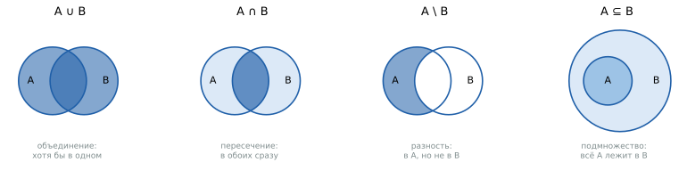
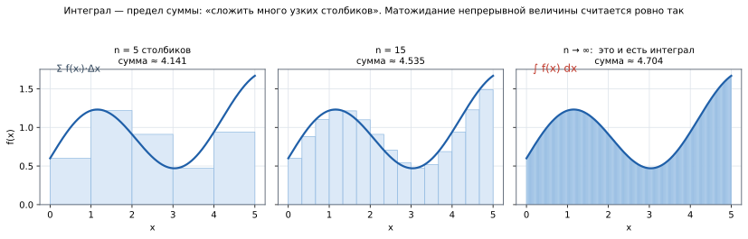
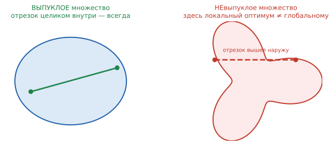
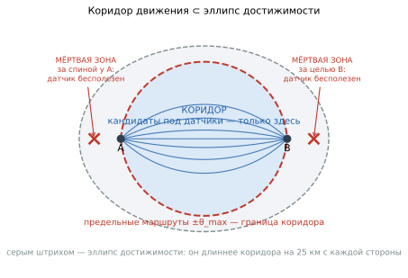

# Геометрия и обозначения: как читать формулы и строить области

> **Учебное пособие.** Часть 2 из 4. Теория оптимизации — в
> [части 1](1_ТЕОРИЯ_ОПТИМИЗАЦИИ.md).

**Документ построен от общего к частному, и первую половину можно читать отдельно от
всего остального:**

| Раздел | О чём | Привязка к задаче |
|---|---|---|
| **§1** | **язык математической записи вообще**: множества, кванторы, суммы, интегралы, пределы, производные, векторы и нормы, вероятностные обозначения, оценки сложности | никакой — это словарь, годный для любой статьи |
| §2–3 | обозначения и базовые построения этой задачи | частичная |
| §4–9 | эллипс, дуги, зоны, физика разворота, дискретизация, фильтры | полная |

Каждое геометрическое построение снабжено разделом **«где применяется в других
задачах»** — те же приёмы работают в логистике, связи, робототехнике.

---

<!-- ОГЛАВЛЕНИЕ · сгенерировано tools/переносимое/docmap.py — руками не править -->
> **Оглавление** — номер строки · раздел. Открывать нужный раздел, а не файл
> целиком (`Read` с `offset`). Пересобрать: `python tools/переносимое/docmap.py`.
>
> `  70` 1. Как читать математическую запись
>   `  75` 1.1. Общематематические символы
>   ` 113` 1.2. Множества и операции над ними
>   ` 162` 1.3. Логика и кванторы
>   ` 189` 1.4. Суммы, произведения, индексы
>   ` 213` 1.5. Интегралы
>   ` 244` 1.6. Пределы и сходимость
>   ` 263` 1.7. Производные и градиент
>   ` 286` 1.8. Векторы, матрицы, нормы
>   ` 306` 1.9. Вероятностные обозначения
>   ` 330` 1.10. Вычислительная сложность: O-нотация
>   ` 349` 1.11. Выпуклость множества
>   ` 367` 1.12. Функциональная запись
>   ` 380` 1.13. Разбор трёх основных формул по словам
> ` 403` 2. Словарь обозначений
>   ` 405` 2.1. Геометрия и исходные данные
>   ` 420` 2.2. Ресурс и модель обнаружения
>   ` 432` 2.3. Случайность и оптимизация
>   ` 447` 2.4. Физика полёта
> ` 464` 3. Базовые построения на плоскости
>   ` 466` 3.1. Вектор, длина, единичный вектор
>   ` 491` 3.2. Скалярное произведение и проекция
>   ` 515` 3.3. Три способа измерять расстояние
> ` 530` 4. Эллипс достижимости
>   ` 532` 4.1. Определение и фокальное свойство
>   ` 558` 4.2. Почему маршрут не может выйти за эллипс — доказательство
>   ` 607` 4.3. Коридор движения: почему эллипса мало
> ` 631` 5. Дуга окружности по углу отклонения
>   ` 635` 5.1. Параметризация одним числом
>   ` 656` 5.2. Предельный угол θ_max
> ` 693` 6. Зона неопределённости и огибающая достижимости
>   ` 697` 6.1. Эллипс неопределённости
>   ` 714` 6.2. Огибающая достижимости
> ` 747` 7. Физика движения как геометрическое ограничение
>   ` 751` 7.1. Минимальный радиус разворота
>   ` 773` 7.2. Кривизна и её ограничение
>   ` 806` 7.3. Ограничение на сетке
> ` 835` 8. Дискретизация: от плоскости к конечному набору
>   ` 846` 8.1. Как выбирается шаг сетки кандидатов
>   ` 867` 8.2. Дискретизация кривой
> ` 879` 9. Типовые геометрические фильтры
>   ` 892` 9.1. Якорная позиция и развязка
> ` 920` 10. Сводка: какое построение для какой задачи
> ` 934` Что дальше
<!-- /ОГЛАВЛЕНИЕ -->

## 1. Как читать математическую запись

Раздел для того, чтобы формулы дальше читались без специальной подготовки. Формат:
**запись — значение — как произносится вслух**.

### 1.1. Общематематические символы

| Запись | Значение | Как читать |
|---|---|---|
| `F(x) → max` | максимизация | «подобрать `x`, при котором `F` наибольшее» |
| `x ∈ D` | принадлежность множеству | «`x` принадлежит `D`», то есть вариант разрешён |
| `A ⊆ B` | подмножество | «`A` содержится в `B`» — всё из `A` есть и в `B` |
| `A ∪ B` | объединение | «`A` вместе с `B`» — всё, что есть хотя бы в одном |
| `A \ B` | разность множеств | «`A` без `B`» — то из `A`, чего нет в `B` |
| `{ P : условие }` | задание множества | «все точки `P`, для которых выполнено условие» |
| `\|PA\|` | расстояние | длина отрезка от `P` до `A` по прямой |
| `\|S\|` | мощность множества | сколько элементов в `S` (у нас — сколько датчиков) |
| `#{ … }` | счётчик | «число элементов, удовлетворяющих условию» |
| `min(a, b)` | наименьшее | берётся меньшее из двух |
| `Σ_{i=1..t}` | сумма | «сложить по всем `i` от 1 до `t`» |
| `Π` | произведение | «перемножить» |
| `𝔼[·]`, `E[·]` | математическое ожидание | среднее по распределению вероятностей |
| `ℙ(·)`, `P(·)` | вероятность | доля случаев, в которых условие выполнено |
| `argmax F(S)` | аргумент максимума | **тот `S`**, на котором `F` наибольшая (не значение!) |
| `𝟙[условие]` | индикатор | 1, если условие истинно; 0, если ложно |
| `√a`, `a²` | корень, квадрат | — |
| `≤ ≥ ≈ ≫` | сравнения | не больше; не меньше; примерно; много больше |
| `x_t`, `γ_i` | нижний индекс | привязка к шагу `t` либо к `i`-му элементу |
| `S*` | звёздочка | оптимальное, искомое значение |
| `F_t → F` | сходимость | «`F_t` стремится к `F` с ростом `t`» |
| `∀`, `∃` | кванторы | «для любого», «существует» |
| `∝` | пропорциональность | «пропорционально» |
| `ℝ²` | плоскость | множество пар вещественных чисел — точек плоскости |

⚠️ **Ловушка — многозначность вертикальных черт.** Символ `|·|` означает разное в
зависимости от того, что внутри:

* `|PA|` (внутри — пара точек) — **расстояние**;
* `|S|` (внутри — множество) — **число элементов**;
* `|θ|` (внутри — число) — **модуль**, значение без знака.

Смысл всегда определяется содержимым, отдельных обозначений для этих случаев не вводят.

### 1.2. Множества и операции над ними



Множество — просто «набор элементов». На языке множеств записываются **все**
ограничения любой оптимизационной задачи, поэтому это базовый словарь.

| Запись | Название | Как читать |
|---|---|---|
| `x ∈ A` | принадлежность | «`x` лежит в `A`» |
| `x ∉ A` | не принадлежит | «`x` в `A` не лежит» |
| `A ⊆ B` | подмножество | «всё, что в `A`, есть и в `B`» |
| `A ⊂ B` | строгое подмножество | то же, но `A ≠ B` |
| `A ∪ B` | объединение | «в `A` **или** в `B`» (хотя бы в одном) |
| `A ∩ B` | пересечение | «в `A` **и** в `B`» (в обоих сразу) |
| `A \ B` | разность | «в `A`, но не в `B`» |
| `Ā`, `Aᶜ` | дополнение | «всё, что вне `A`» |
| `∅` | пустое множество | «ничего нет» |
| `\|A\|` | мощность | сколько элементов в `A` |
| `2^A` | булеан | множество **всех подмножеств** `A` |
| `A × B` | декартово произведение | все пары `(a, b)` |

**Три способа задать одно и то же множество** — это важно, потому что в разных статьях
одна и та же область записана по-разному:

| Способ | Пример (круг радиуса `R` вокруг `s`) |
|---|---|
| **перечислением** | `A = {1, 2, 3}` — годится только для конечных |
| **условием** (характеристическое свойство) | `D(s) = { x ∈ ℝ² : \|x − s\| ≤ R }` |
| **параметризацией** | `D(s) = { s + r·(cos α, sin α) : 0 ≤ r ≤ R, 0 ≤ α < 2π }` |

Запись через условие читается так: «фигурная скобка — множество всех `x` из плоскости
**таких, что** (двоеточие) расстояние до `s` не больше `R`». Двоеточие иногда заменяют
вертикальной чертой: `{ x | условие }` — это то же самое.

⚠️ **Ловушка.** `2^A` — не «два в степени множество», а **булеан**: набор всех
подмножеств. Обозначение выбрано потому, что у множества из `n` элементов ровно `2ⁿ`
подмножеств. Целевая функция размещения формально записывается как `F : 2^C → ℝ` —
«каждому набору позиций сопоставляется число».

**Числовые множества**, встречающиеся постоянно:

```
ℕ — натуральные (1, 2, 3, …)        ℤ — целые (…, −1, 0, 1, …)
ℚ — рациональные (дроби)            ℝ — вещественные (все числа на прямой)
ℝⁿ — n-мерное пространство          ℝ₊ — неотрицательные вещественные
{0, 1} — двоичные (да/нет)          [a, b] — отрезок, (a, b) — интервал без концов
```

### 1.3. Логика и кванторы

| Запись | Значение | Как читать |
|---|---|---|
| `∀x` | квантор всеобщности | «для любого `x`», «для всех `x`» |
| `∃x` | квантор существования | «существует `x`» |
| `∃!x` | единственность | «существует ровно один `x`» |
| `⟹` | импликация | «если …, то …», «влечёт» |
| `⟺`, `≡` | эквивалентность | «тогда и только тогда» |
| `∧` | конъюнкция | «и» |
| `∨` | дизъюнкция | «или» |
| `¬` | отрицание | «не» |
| `:=` | определение | «положим по определению равным» |
| `∎`, `□` | конец доказательства | «что и требовалось доказать» |

> 🧮 **Пример чтения.** Определение субмодулярности:
> ```
> ∀ A ⊆ B ⊆ C,  ∀ v ∉ B :   Δ(v | A) ≥ Δ(v | B)
> ```
> «Для любых двух множеств `A` и `B` таких, что `A` содержится в `B`, а `B` — в `C`, и
> для любого элемента `v`, не входящего в `B`, прирост от добавления `v` к меньшему
> множеству не меньше прироста от добавления к большему».

⚠️ **Порядок кванторов меняет смысл.** `∀x ∃y : P(x,y)` («для каждого `x` найдётся
свой `y`») и `∃y ∀x : P(x,y)` («есть один общий `y` для всех `x`») — разные
утверждения. Второе сильнее.

### 1.4. Суммы, произведения, индексы

```
Σ_{i=1}^{n} a_i  =  a₁ + a₂ + … + a_n           Π_{i=1}^{n} a_i  =  a₁ · a₂ · … · a_n
```

* `Σ` («сигма») — сложить, `Π` («пи» прописная) — перемножить;
* снизу — с чего начинаем, сверху — чем заканчиваем;
* `i` — **индекс суммирования**: рабочая переменная, вне суммы смысла не имеет.

**Суммирование по множеству** — очень частая запись:

```
Σ_{e ∈ E} w_e        «сложить веса по всем ячейкам множества E»
Σ_{c ∈ S : d(c) < R} 1    «сосчитать те c из S, для которых выполнено условие»
```

**Двойная сумма** `Σ_i Σ_j a_{ij}` — сложить по всем парам; порядок для конечных сумм
не важен.

⚠️ **Пустая сумма равна нулю, пустое произведение — единице.** Это не курьёз: из
`F(∅) = 0` (сумма по пустому множеству) начинается индукция в доказательстве гарантии
жадного алгоритма.

### 1.5. Интегралы



> 📐 **Строго.** `∫_a^b f(x) dx` — предел суммы `Σ f(xᵢ)·Δx` при `Δx → 0`; численно
> равен площади под графиком `f` на отрезке `[a, b]`.

> 💬 **По-простому.** Интеграл — та же сумма, только слагаемых бесконечно много и
> каждое бесконечно мало. Знак `∫` — вытянутая буква S, от слова «сумма».

**Разбор записи:** `f(x)` — что складываем; `dx` — по какой переменной идём и с каким
шагом; `a`, `b` — границы. Кратные интегралы `∬`, `∭` — то же по площади и объёму;
интеграл по области записывается `∫_D f dx`.

**Зачем это в теории оптимизации.** Математическое ожидание непрерывной случайной
величины — именно интеграл:

```
𝔼[X] = ∫ x · p(x) dx          где p(x) — плотность вероятности
```

А целевая функция стохастической задачи — интеграл по пространству сценариев:

```
F(S) = 𝔼_Γ[ φ(S, Γ) ] = ∫ φ(S, γ) · dℙ(γ)
```

⚠️ Именно **невычислимость этого интеграла** (пространство сценариев — все возможные
кривые) и заставляет перейти к выборочному среднему. Связь прямая: интеграл заменяется
конечной суммой, `∫ → (1/t)·Σ`.

### 1.6. Пределы и сходимость

| Запись | Как читать |
|---|---|
| `lim_{t→∞} F_t = F` | «`F_t` стремится к `F` при неограниченном росте `t`» |
| `F_t → F` | краткая форма того же |
| `x_n → x*  (n → ∞)` | последовательность сходится к `x*` |
| `O(·)`, `o(·)` | оценки скорости роста (см. §1.10) |
| `≈` | приближённо равно |
| `∼` | ведёт себя как (асимптотически) |

**Виды сходимости для случайных величин** — их различают, и в статьях это указывают
явно:

* **по вероятности** — отклонение больше любого `ε` становится всё менее вероятным;
* **почти наверное** (с вероятностью 1) — сильнее; именно так формулируется усиленный
  закон больших чисел;
* **в среднем квадратичном** — стремится к нулю `𝔼[(X_n − X)²]`.

### 1.7. Производные и градиент


| Запись | Значение |
|---|---|
| `f′(x)`, `df/dx` | производная — скорость изменения функции |
| `∂f/∂x_i` | частная производная — по одной переменной, остальные заморожены |
| `∇f` («набла») | **градиент** — вектор из всех частных производных |
| `∇²f`, `H` | матрица вторых производных (гессиан) |
| `argmin`, `argmax` | точка, где достигается экстремум |

> 💬 **По-простому.** Градиент — стрелка, показывающая, в какую сторону функция растёт
> быстрее всего. Она всегда перпендикулярна линии уровня (линии постоянного значения),
> как склон перпендикулярен горизонталям на топографической карте.

**Условие экстремума** гладкой функции: `∇f = 0` — в вершине склона нет.

⚠️ **Где градиента нет.** Если функция ступенчатая (например, индикатор «точка попала
в круг» — 0 или 1), производная равна нулю почти всюду и не существует в точке скачка.
Никакой информации «куда сдвинуть» градиент не даёт — поэтому к задачам дискретного
выбора градиентные методы неприменимы в принципе, и нужен другой аппарат.

### 1.8. Векторы, матрицы, нормы

```
x = (x₁, …, x_n) ∈ ℝⁿ        вектор-строка         xᵀ — транспонирование
A ∈ ℝ^{m×n}                  матрица m строк × n столбцов
Ax                           умножение матрицы на вектор
det A                        определитель            A⁻¹ — обратная матрица
```

**Нормы** — способы измерить «величину» вектора:

| Запись | Название | Формула | Смысл |
|---|---|---|---|
| `‖x‖₂`, `\|x\|` | евклидова (L2) | `√(Σ xᵢ²)` | обычная длина, «по прямой» |
| `‖x‖₁` | манхэттенская (L1) | `Σ \|xᵢ\|` | «по улицам», сумма модулей |
| `‖x‖_∞` | максимум-норма | `max \|xᵢ\|` | наибольшая из координат |

⚠️ В геометрических формулах `|x − s|` почти всегда означает **евклидову норму**, даже
если индекс 2 не написан. Если имеется в виду другая — это оговаривают.

### 1.9. Вероятностные обозначения

| Запись | Значение | Как читать |
|---|---|---|
| `ℙ(A)`, `P(A)` | вероятность события | «вероятность того, что произошло `A`» |
| `ℙ(A \| B)` | условная вероятность | «вероятность `A` **при условии** `B`» |
| `X ~ N(μ, σ²)` | закон распределения | «`X` распределена нормально с параметрами …» |
| `𝔼[X]`, `M[X]` | математическое ожидание | среднее значение по распределению |
| `𝔻[X]`, `Var[X]`, `σ²` | дисперсия | мера разброса |
| `σ` | среднеквадратичное отклонение | `√дисперсии`, в тех же единицах, что `X` |
| `𝟙[условие]` | индикатор | 1, если условие верно; иначе 0 |
| `p(x)` | плотность вероятности | «сколько вероятности приходится на точку» |
| `F(x) = ℙ(X ≤ x)` | функция распределения | накопленная вероятность |
| `q_α` | квантиль уровня `α` | значение, ниже которого доля `α` наблюдений |
| `i.i.d.` | независимые одинаково распределённые | стандартное требование к выборке |

⚠️ **Три разных `F`.** В одном тексте `F` может означать целевую функцию `F(S)`,
функцию распределения `F(x)` и силу в физике. Это не ошибка записи — так исторически
сложилось; смысл различают по аргументу и контексту, но в собственном тексте лучше
переобозначить.

Подробно про вероятность и её роль в оптимизации —
[часть 1 §7](1_ТЕОРИЯ_ОПТИМИЗАЦИИ.md).

### 1.10. Вычислительная сложность: O-нотация

| Запись | Как читать | Пример |
|---|---|---|
| `O(n)` | «растёт не быстрее, чем `n`» | один проход по массиву |
| `O(n²)` | квадратично | сравнение всех пар |
| `O(N·\|C\|)` | произведение двух размеров | жадный выбор `N` из `\|C\|` |
| `O(2ⁿ)`, `O(n!)` | экспоненциально, факториально | полный перебор — практически неподъёмен |
| `Θ(·)` | точный порядок роста (и сверху, и снизу) | — |
| `Ω(·)` | оценка снизу | — |

> 💬 **По-простому.** Запись `O(·)` отвечает не на вопрос «сколько секунд», а на
> вопрос «во сколько раз дольше, если задача вырастет вдвое». Для `O(n)` — вдвое, для
> `O(n²)` — вчетверо, для `O(2ⁿ)` — в миллиарды раз.

**NP-трудная задача** — та, для которой не известно алгоритма с полиномиальным
временем; практически это означает «точное решение при росте размерности становится
неподъёмным, нужен приближённый метод с оценкой качества».

### 1.11. Выпуклость множества



> 📐 **Строго.** Множество `D` **выпукло**, если для любых двух его точек `x, y ∈ D` и
> любого `λ ∈ [0, 1]` точка `λx + (1−λ)y` тоже принадлежит `D`.

> 💬 **По-простому.** Натяните отрезок между любыми двумя точками фигуры: если он
> нигде не вышел наружу — фигура выпуклая.

**Почему это важно для оптимизации.** Если и допустимое множество выпукло, и целевая
функция вогнута (для задачи на максимум), то **локальный оптимум обязательно является
глобальным** — и градиентные методы дают точный ответ. Как только выпуклость теряется,
появляются ловушки-локальные оптимумы, и гарантии исчезают.

Эллипс достижимости (§4) — выпуклое множество. А вот область, из которой вырезаны
города и водоёмы, — уже нет.

### 1.12. Функциональная запись

Запись `φ(S, γ)` означает, что величина `φ` зависит **одновременно** от двух
аргументов: расстановки `S` и маршрута `γ`. Меняется любой из них — меняется `φ`.
Так же читаются `n(S, γ)`, `m(S, γ)`, `F(S)`.

> 💬 **По-простому.** Скобки — это «зависит от». `φ(S, γ)` = «оценка, которая зависит
> от того, где стоят датчики, и от того, каким маршрутом летел аппарат».

**Отображение** записывается стрелкой: `f : X → Y` — «функция `f` каждому элементу из
`X` сопоставляет элемент из `Y`». Примеры: `F : 2^C → ℝ` (набору позиций — число),
`w : E → ℝ₊` (ячейке — неотрицательный вес).

### 1.13. Разбор трёх основных формул по словам

```
φ(S, γ) = α₁ · min(n, k)/k + α₂ · m/L_seg
```
«Полезность складывается из двух частей: доля выполнения требования по кратности
`min(n,k)/k` (она не превышает единицы, потому что засечки сверх `k` усечены) с
весом `α₁`, плюс доля покрытых сегментов `m/L_seg` с весом `α₂`».

```
F(S) = 𝔼[φ(S, γ)] → max     при |S| ≤ N
```
«Среди всех расстановок не более чем из `N` датчиков найти такую, при которой среднее
по случайному маршруту значение полезности наибольшее».

```
F_t(S) = (1/t) · Σ_{i=1..t} φ(S, γᵢ)
```
«Оценка целевой функции: сложить полезности расстановки `S` на всех `t` накопленных
маршрутах и разделить на их число — то есть взять среднее».

---

## 2. Словарь обозначений

### 2.1. Геометрия и исходные данные

| Символ | Значение | Единицы |
|---|---|---|
| `A`, `B` | точка старта и точка цели | координаты, км |
| `\|AB\|` | расстояние между ними | км |
| `L_max` | **запас хода** — предельная длина маршрута | км |
| `a`, `b`, `c` | большая полуось, малая полуось, фокальное расстояние эллипса | км |
| `E` | эллипс достижимости (множество точек) | — |
| `P` | произвольная точка плоскости | — |
| `S₀` | точка старта конкретного маршрута (вкладка 2) | — |
| `θ` («тета») | угол отклонения дуги; `θ_max` — предельный | градусы / радианы |
| `s(θ)` | стрела прогиба — поперечное удаление дуги от хорды | км |
| `û`, `n̂` | единичный вектор оси `A→B` и перпендикуляр к ней | — |

### 2.2. Ресурс и модель обнаружения

| Символ | Значение | Значение по умолчанию |
|---|---|---|
| `N` | число датчиков (фиксированный ресурс) | 6 (вкл. 1–2) / 15 (вкл. 3) |
| `R` | радиус обнаружения датчика | 12 км / 2 км |
| `k` | требуемая кратность — минимум засечек | 3 |
| `L_seg` | число сегментов разбиения маршрута | 10 |
| `S` | расстановка датчиков, `S = {s₁ … s_N}` | — |
| `C` | множество кандидатных позиций | — |
| `D(s)` | зона обнаружения датчика: `{ x : \|x − s\| ≤ R }` | — |

### 2.3. Случайность и оптимизация

| Символ | Значение |
|---|---|
| `Γ` / `γ` | случайный маршрут как величина / его конкретная реализация |
| `t` | номер итерации и одновременно размер накопленной выборки |
| `T` | итоговое число итераций |
| `n(S, γ)` | кратность — число **различных** засёкших датчиков |
| `m(S, γ)` | число покрытых сегментов маршрута |
| `c(S, γ)` | непрерывное покрытие — доля длины пути под наблюдением |
| `φ(S, γ)` («фи») | полезность расстановки на маршруте |
| `α₁, α₂` («альфа») | веса критериев кратности и равномерности |
| `F(S)`, `F_t(S)` | целевая функция: истинная и оценённая по выборке |
| `Δ(v \| S)` | предельный прирост от добавления `v` к `S` |

### 2.4. Физика полёта

| Символ | Значение | Единицы |
|---|---|---|
| `V` | путевая скорость аппарата | м/с (вводится в км/ч) |
| `φ_кр` | максимальный угол крена | градусы (в формуле — радианы) |
| `g` | ускорение свободного падения = 9.81 | м/с² |
| `R_min` | минимальный радиус разворота | км |
| `κ` («каппа») | кривизна траектории, `κ = 1/R` | 1/км |
| `Δψ` («дельта пси») | угол доворота в вершине ломаной | градусы |

⚠️ **Ловушка — две «фи».** `φ(S, γ)` — полезность расстановки, `φ` в формуле
`R_min` — угол крена. Совпадение обозначений историческое; в этом пособии угол крена
обозначается `φ_кр` там, где возможна путаница.

---

## 3. Базовые построения на плоскости

### 3.1. Вектор, длина, единичный вектор

Точка задаётся парой координат: `P = (x, y)`. Вектор из `A` в `B` — разность
координат:

```
v = B − A = (B_x − A_x,  B_y − A_y)
```

Длина вектора (**евклидова норма**) — по теореме Пифагора:

```
|v| = √( v_x² + v_y² )
```

**Единичный вектор** (орт) — вектор той же длины, укороченный до 1:

```
v̂ = v / |v|
```

> 💬 **По-простому.** Орт — это «стрелка направления»: он говорит, **куда**, но не
> **насколько далеко**. Умножив орт на число, получаем смещение на нужное расстояние
> в нужную сторону.

### 3.2. Скалярное произведение и проекция

```
u · v = u_x·v_x + u_y·v_y = |u| · |v| · cos α
```

где `α` — угол между векторами. Главное применение — **проекция**: насколько точка
продвинулась вдоль заданной оси.

```
проекция P на ось A→B  =  (P − A) · û
```

> 🧮 **Пример расчёта.** `A = (0, 0)`, `B = (100, 0)`, значит `û = (1, 0)`.
> Кандидатная позиция `P = (118, 20)`.
> Проекция: `(118, 20) · (1, 0) = 118`. Это больше `|AB| = 100`, следовательно точка
> лежит **за целью**. Маршруты в `B` заканчиваются, значит датчик там бесполезен —
> кандидат отбрасывается (правило «не размещать за целью»).

**Где применяется в других задачах:** отбор точек «впереди / позади» по направлению
движения — типовой приём в логистике (отсев складов не по пути), в обработке
изображений (проекция на главную ось), в робототехнике (продольная и поперечная
ошибка следования по траектории).

### 3.3. Три способа измерять расстояние

| Метрика | Формула | Где применяется |
|---|---|---|
| **евклидова** | `√(Δx² + Δy²)` | полёт по прямой, дальность датчика |
| **манхэттенская** | `\|Δx\| + \|Δy\|` | движение по улицам прямоугольной сетки |
| **по сетке 8-связной** | шаг 1 по стороне, `√2` по диагонали | путь по ячейкам карты (вкладка 3) |

⚠️ **Ловушка.** На регулярной сетке кратчайший путь по 4-связности длиннее
евклидова на 41 % при движении «по диагонали». Поэтому в задачах планирования по
ячейкам используют **8-связность** и вес диагонального шага `√2 ≈ 1.414` — иначе
модель систематически завышает длину пути.

---

## 4. Эллипс достижимости

### 4.1. Определение и фокальное свойство


> 📐 **Строго.** Эллипс — геометрическое место точек плоскости, сумма расстояний от
> которых до двух заданных точек (**фокусов**) постоянна. Область достижимости при
> ограниченной длине пути:
>
> ```
> E = { P : |PA| + |PB| ≤ L_max }
> ```

**Параметры выражаются через исходные данные:**

```
большая полуось    a = L_max / 2
фокальное расст.   c = |AB| / 2
малая полуось      b = √(a² − c²)
центр              середина отрезка AB
поворот            направление A→B
```

**Разбор:** `a` — наибольшее удаление достижимой точки вдоль оси `A–B`;
`c` — половина расстояния между фокусами; `b` — наибольшее поперечное отклонение,
получается по теореме Пифагора для фокального треугольника.

### 4.2. Почему маршрут не может выйти за эллипс — доказательство

Утверждение важно тем, что **избавляет от проверки в цикле**: не нужно на каждом шаге
контролировать, не вышли ли за дальность.

**Доказательство.** Пусть `P` — произвольная точка маршрута полной длины `L ≤ L_max`.
Обозначим `L₁` — длину участка от `A` до `P`, `L₂` — от `P` до `B`; очевидно
`L₁ + L₂ = L`. Расстояние по прямой не превышает длины пути между теми же точками:

```
|PA| ≤ L₁ ,     |PB| ≤ L₂
```

Складывая: `|PA| + |PB| ≤ L₁ + L₂ = L ≤ L_max`. Значит `P ∈ E`. ∎

> 💬 **По-простому.** Прямая — кратчайший путь. Если суммарная длина полёта не больше
> `L_max`, то и сумма двух прямых отрезков (до точки и от неё) не больше `L_max`. А
> это в точности определение эллипса.

> 🧮 **Пример расчёта.** `|AB| = 100 км`, `L_max = 150 км`.
> ```
> a = 150 / 2 = 75 км
> c = 100 / 2 = 50 км
> b = √(75² − 50²) = √(5625 − 2500) = √3125 ≈ 55.9 км
> ```
> Проверим точку `P = (12, 45)` в системе с центром посередине `AB`
> (`A = (−50, 0)`, `B = (50, 0)`):
> ```
> |PA| = √((12+50)² + 45²) = √(3844 + 2025) = √5869 ≈ 76.6 км
> |PB| = √((12−50)² + 45²) = √(1444 + 2025) = √3469 ≈ 58.9 км
> сумма ≈ 135.5 км  ≤  150 км   ✔  точка достижима
> ```
> Проверим `P′ = (0, 60)`:
> ```
> |P′A| = |P′B| = √(50² + 60²) = √6100 ≈ 78.1 км,  сумма ≈ 156.2 > 150  ✘ недостижима
> ```

**Где применяется в других задачах.** Эллипс с фокусами — универсальный способ
очертить «куда можно успеть при ограниченном ресурсе»:

* **логистика:** зона, куда курьер может заехать по пути от склада к клиенту, не
  превысив лимит пробега;
* **связь:** область возможного положения источника по разности времён прихода
  сигнала (там работает гипербола — «вторая половина» той же фокальной идеи);
* **планирование маршрутов транспорта:** отсев остановок, включение которых
  заведомо ломает расписание;
* **поиск и спасение:** область, где может находиться объект с известным запасом
  топлива, при известной точке вылета и предполагаемой точке назначения.

### 4.3. Коридор движения: почему эллипса мало



Эллипс — **строгая, но грубая** оболочка: он содержит области, в которые реальный
маршрут из `A` в `B` не заходит никогда. Прежде всего это зоны **за спиной у `A`** и
**за целью `B`**: эллипс длиннее отрезка `AB` на `a − c` с каждой стороны (в примере
выше — на 25 км).

Поэтому кандидатные позиции датчиков ограничивают не эллипсом, а **коридором** —
областью между предельными маршрутами:

| Модель движения | Граница коридора |
|---|---|
| дуги | между дугами `±θ_max` |
| змейки (петли) | под огибающей `\|y\| ≤ b · sin(πx/d)` |
| манёвр по точкам | половины эллипса достижимости |

**Двойное применение коридора:** (1) фильтр кандидатных позиций — датчик вне коридора
бесполезен; (2) подгонка масштаба карты — при `L_max ≫ |AB|` эллипс огромен, и без
коридора изображение оказывается пустым на 90 %.

---

## 5. Дуга окружности по углу отклонения


### 5.1. Параметризация одним числом

Дуга, соединяющая `A` и `B`, полностью задаётся **одним** числом — знаковым
касательно-хордовым углом `θ` (угол между хордой `AB` и касательной к дуге в точке `A`).

```
радиус дуги      R_arc = c_len / (2 · sin θ)
длина дуги       ℓ(θ)  = c_len · θ / sin θ          (θ в радианах)
стрела прогиба   s(θ)  = c_len · (1 − cos θ) / (2 · sin θ)
```

где `c_len = |AB|` — длина хорды.

**Свойства:** `θ = 0` — полёт по прямой; рост `|θ|` — дуга длиннее и круче; знак `θ`
задаёт сторону отклонения.

⚠️ **Ловушка — единицы угла.** В формулах `ℓ(θ)` и `s(θ)` угол **в радианах**
(иначе `θ/sin θ` бессмысленно), а в интерфейсе и в подписях — **в градусах**.
Перевод: `радианы = градусы · π / 180`. Это классический источник ошибок: формула
даёт правдоподобный, но неверный результат — не падает, а тихо врёт.

### 5.2. Предельный угол θ_max

`θ_max` — тот угол, при котором длина дуги достигает запаса хода:

```
ℓ(θ_max) = L_max
```

Уравнение **трансцендентное** (не разрешается в радикалах), поэтому корень находят
численно — **бинарным поиском** (дихотомией): отрезок возможных значений угла
последовательно делится пополам, пока длина не совпадёт с `L_max` с нужной точностью.

> 💬 **По-простому.** Ищем угол «на ощупь»: взяли середину диапазона, посчитали длину;
> получилось мало — двигаемся вправо, много — влево; и так пока не сойдётся.
> Двадцати делений хватает, чтобы попасть с точностью до миллионных долей.

> 🧮 **Пример расчёта.** `|AB| = 100 км`, `L_max = 150 км`. Нужно `θ/sin θ = 1.5`.
>
> | Проба `θ` | `θ` рад | `sin θ` | `θ/sin θ` | Вывод |
> |---|---|---|---|---|
> | 60° | 1.047 | 0.866 | 1.209 | мало → вправо |
> | 90° | 1.571 | 1.000 | 1.571 | много → влево |
> | 75° | 1.309 | 0.966 | 1.355 | мало → вправо |
> | 85° | 1.484 | 0.996 | 1.490 | почти |
> | **85.7°** | 1.496 | 0.997 | **1.500** | ✔ найдено |
>
> Итог: `θ_max ≈ 85.7°`, длина предельной дуги ровно 150 км. Стрела прогиба при этом
> `s = 100·(1 − cos 85.7°)/(2·sin 85.7°) ≈ 46.4 км`.

**Где применяется в других задачах.** Однопараметрическое семейство кривых с
закреплёнными концами — удобный способ порождать правдоподобные варианты пути там,
где точная траектория неизвестна: планирование обгонов, генерация вариантов
трубопровода или дороги между двумя пунктами, аппроксимация трека по двум точкам и
оценке кривизны.

---

## 6. Зона неопределённости и огибающая достижимости


### 6.1. Эллипс неопределённости

Когда точка старта известна лишь приблизительно, она задаётся не точкой, а областью —
эллипсом с центром `A`, вытянутым вдоль оси `A→B`:

```
( (P − A)·û / (depth/2) )²  +  ( (P − A)·n̂ / (width/2) )²  ≤  1
```

**Разбор символов:** `û` — орт оси `A→B`; `n̂` — перпендикуляр к ней;
`depth` — глубина зоны (вдоль оси), `width` — ширина (поперёк); деление на полуоси
приводит эллипс к единичной окружности, поэтому условие принадлежности — «сумма
квадратов ≤ 1».

> 💬 **По-простому.** Формула проверяет: если сжать эллипс так, чтобы он стал кругом
> радиуса 1, попадёт ли точка внутрь этого круга.

### 6.2. Огибающая достижимости

⚠️ **Ловушка.** Если старт — не точка `A`, а любая точка `S₀` из зоны, то **эллипс
(A, B) больше не является границей достижимости**: маршрут из `S₀` лежит в эллипсе
`(S₀, B)`, а таких эллипсов столько же, сколько точек в зоне.

Правильная граница — **объединение** всех этих эллипсов:

```
Reach = { P : dist(P, зона) + |P − B| ≤ L_max }
```

где `dist(P, зона)` — расстояние от точки до **ближайшей точки зоны**.

**Как это считается на практике.** Все эллипсы имеют общий фокус `B`, поэтому
объединение звёздно относительно `B` — луч из `B` пересекает границу ровно один раз.
Значит, достаточно для каждого направления `d̂` найти максимальный радиус, взяв
максимум по точкам границы зоны, через полярное уравнение эллипса из фокуса:

```
r(S₀, d̂) = ( L_max² − |B − S₀|² ) / ( 2 · ( L_max + (B − S₀) · d̂ ) )
```

Это даёт замкнутый контур, за который **не выходит ни один** маршрут — при том, что
считается он за один проход по направлениям, а не перебором всех маршрутов.

**Где применяется в других задачах.** Объединение областей достижимости по множеству
начальных состояний — стандартная задача анализа достижимости в теории управления
(reachable set); тот же приём применяется в оценке зоны поражения при неизвестной
точке пуска и в планировании зон покрытия при неточно известном положении абонента.

---

## 7. Физика движения как геометрическое ограничение


### 7.1. Минимальный радиус разворота

> 📐 **Строго.** В координированном развороте с креном `φ_кр` на скорости `V`
> подъёмная сила даёт горизонтальную составляющую, играющую роль центростремительной:
>
> ```
> R_min = V² / ( g · tan φ_кр )
> ```

**Разбор:** `V` — путевая скорость, **м/с**; `φ_кр` — предельный угол крена, **радианы**;
`g = 9.81 м/с²`; результат — в метрах, в модели переводится в километры.

> 🧮 **Пример расчёта.** `V = 180 км/ч`, `φ_кр = 25°`.
> ```
> V   = 180 / 3.6 = 50 м/с
> tan 25° = 0.4663
> R_min = 50² / (9.81 · 0.4663) = 2500 / 4.574 ≈ 546.5 м ≈ 0.55 км
> ```
> **Проверка чувствительности:** при `V = 360 км/ч` (вдвое быстрее) получим
> `R_min ≈ 2.19 км` — вчетверо больше. Радиус растёт как **квадрат** скорости, и это
> главное следствие формулы: быстрый аппарат разворачивается несопоставимо шире.

### 7.2. Кривизна и её ограничение

**Кривизна** `κ = 1/R` — величина, обратная радиусу: чем круче поворот, тем она
больше. Физическое ограничение записывается одним неравенством:

```
κ ≤ 1 / R_min
```

Оно применяется двумя способами, в зависимости от того, как порождается маршрут:

**(а) Скругление углов ломаной.** В вершине с доворотом `Δψ` вместо излома
вставляется дуга радиуса `R`, касающаяся обоих звеньев:

```
R = T / tan(Δψ / 2),      T = turn_frac · min(ℓ_вх, ℓ_вых),      R ≥ R_min
```

где `T` — расстояние от вершины до точки касания, `ℓ_вх`, `ℓ_вых` — длины входящего и
исходящего звена, `turn_frac` — доля, задающая пологость.

**(б) Ограничение амплитуд гармоник.** Если маршрут задан суммой синусоид
`lat(t) = Σ_j a_j · sin(jπt)`, кривизна оценивается как `|a_j|·(jπ/D)²`, и при
нарушении все амплитуды масштабируются общим коэффициентом:

```
Σ_j |a_j| · (jπ/D)²  ≤  1/R_min ,     иначе    f = (1/R_min) / Σ(…)
```

⚠️ **Ловушка.** Высокие гармоники «дороже» низких: множитель `j²` означает, что
пятая гармоника при той же амплитуде даёт кривизну в 25 раз большую, чем первая.
Поэтому мелкая частая рябь нарушает физику раньше, чем крупная плавная волна.

### 7.3. Ограничение на сетке

При планировании по ячейкам радиус разворота выражается в **предельном угле поворота
за шаг**. Связь: поворот на угол `α` за шаг длиной `h` даёт радиус

```
R ≈ h / (2 · sin(α/2))
```

> 🧮 **Пример расчёта.** Шаг сетки `h = 500 м`.
> ```
> α = 45°:  R = 0.5 / (2 · sin 22.5°) = 0.5 / 0.765 ≈ 0.65 км   ✔  больше R_min = 0.55
> α = 90°:  R = 0.5 / (2 · sin 45°)   = 0.5 / 1.414 ≈ 0.35 км   ✘  меньше R_min
> ```
> Отсюда предел поворота за шаг — **45°**, а не 90°.

⚠️ **Вторая ловушка — накопление поворота.** Ограничение на **один** шаг не
запрещает набрать разворот на 180° за четыре шага по 45°, формально не нарушив ни
одного ограничения. Поэтому вводят **второе, оконное** условие: суммарный доворот на
отрезке заданной длины (например, 3 км) не более 90°.

**Где применяется в других задачах.** Ограничение кривизны — общее место в
планировании путей для любой техники с неголономными связями: автомобиль (кривые
Дубинса, Ридса–Шеппа), судно, поезд, промышленный робот. Всюду та же схема: сначала
геометрический путь, затем проверка «может ли аппарат по нему пройти», затем
сглаживание до выполнимого.

---

## 8. Дискретизация: от плоскости к конечному набору

Оптимизация по непрерывным координатам в общем случае неподъёмна, поэтому область
заменяется **конечным множеством**. Три типовых способа.

| Способ | Как строится | Где применён |
|---|---|---|
| **регулярная сетка ячеек** | плоскость режется на квадраты со стороной `h` | весовая карта местности, 500 × 500 м |
| **сетка кандидатов** | узлы с шагом `step`, отфильтрованные по области | позиции датчиков |
| **дискретизация кривой** | маршрут представляется `n_points` точками | расчёт засечек и покрытия |

### 8.1. Как выбирается шаг сетки кандидатов

Правило: **шаг не должен превышать зону обзора**. Иначе между соседними кандидатами
остаётся полоса шире, чем видит датчик, и лучшая позиция просто недоступна для выбора.

> 🧮 **Пример расчёта — замер из проекта.** `R = 2 км`, 5 датчиков:
>
> | Шаг сетки | Кандидатов | Засечка | Время |
> |---|---|---|---|
> | 0.5 км | 17 847 | 96.7 % | 3.2 с |
> | **1.0 км** (= `R`/2) | **4 436** | **96.7 %** | **0.8 с** |
> | 3.0 км | ~500 | 82.7 % | — |
> | 6.0 км | ~130 | 17.3 % | — |
>
> Половина радиуса — рабочий компромисс: качество как у мелкой сетки, перебор вчетверо
> меньше. Дальнейшее измельчение даёт доли процента при четырёхкратном росте времени.

⚠️ **Ловушка.** Число кандидатов растёт **квадратично** при измельчении шага: вдвое
мельче — вчетверо больше точек. А время жадного выбора линейно по числу кандидатов,
`O(N·|C|)`. Поэтому «сделаем сетку помельче, хуже не будет» — плохая стратегия.

### 8.2. Дискретизация кривой

Маршрут представляется массивом `n_points` точек. Отсюда два следствия:

* **факт засечки** проверяется как `min_t |γ(t) − s_j| ≤ R` — минимум расстояния по
  всем точкам маршрута;
* **точность** ограничена шагом дискретизации: если между соседними точками маршрут
  «пролетает» через край зоны, засечка может быть пропущена. Правило: шаг
  дискретизации должен быть заметно меньше `R`.

---

## 9. Типовые геометрические фильтры

Набор правил «где датчик ставить нельзя», выраженных через уже введённые операции.
Все они — примеры того, как содержательное требование превращается в неравенство.

| Правило | Формула | Смысл |
|---|---|---|
| не за целью | `(P − A) · û ≤ \|AB\|` | маршруты кончаются в `B`, дальше ловить некого |
| не за спиной у старта | `(P − A) · û ≥ −depth/2` | только в полупространстве к цели |
| не внутри зоны старта | нарушение неравенства §6.1 | в районе пуска датчик не разместить |
| минимальный разнос | `\|s_i − s_j\| ≥ sep` | зоны не должны сливаться |
| вне коридора | точка не в области §4.3 | туда маршрут не заходит |

### 9.1. Якорная позиция и развязка

**Якорь** — принудительно занятая позиция, выбираемая до жадного перебора. У цели
датчик ставится в точке `B − (2/3)R · ê∥`, так что его зона на `1/3 R` заходит за `B`:
рубеж оказывается непосредственно у цели, а сам датчик — по эту сторону.

**Развязка:** кандидаты ближе `anchor_sep = 1.35 · R` к якорю исключаются. Это
соответствует перекрытию зон около 10 %.

> 🧮 **Пример расчёта — площадь перекрытия двух кругов.** Для кругов радиуса `R` с
> расстоянием между центрами `d`:
>
> ```
> S_пересечения = 2R² · arccos( d / 2R )  −  (d/2) · √( 4R² − d² )
> ```
>
> При `d = 1.35·R`: `arccos(0.675) ≈ 0.8288` рад, `√(4 − 1.8225) ≈ 1.4757`.
> ```
> S = 2R²·0.8288 − 0.675R·1.4757·R = 1.6576R² − 0.9961R² = 0.6615R²
> доля от площади одного круга:  0.6615R² / (πR²) = 0.211  → ≈ 21 %
> доля от площади ОБЪЕДИНЕНИЯ:   0.6615 / (2π − 0.6615)   = 0.118 → ≈ 12 %
> ```
> Отсюда и формулировка «перекрытие порядка 10 %»: считается доля от общей
> накрываемой площади, а не от одного круга. ⚠️ При сравнении таких чисел всегда
> уточняйте знаменатель — разница вдвое.

---

## 10. Сводка: какое построение для какой задачи

| Нужно | Построение | Раздел |
|---|---|---|
| очертить «куда можно успеть при лимите ресурса» | эллипс с фокусами | §4.1 |
| то же при неизвестной точке начала | огибающая эллипсов | §6.2 |
| отсечь заведомо бесполезные позиции | проекция на ось + коридор | §3.2, §4.3 |
| породить правдоподобные варианты пути | однопараметрическое семейство дуг | §5.1 |
| учесть, что техника не поворачивает на месте | ограничение кривизны `κ ≤ 1/R_min` | §7.2 |
| перейти от непрерывной задачи к решаемой | регулярная сетка, шаг ≤ зоны обзора | §8.1 |
| не дать выбранным точкам слипнуться | минимальный разнос через перекрытие площадей | §9.1 |

---

## Что дальше

| Документ | О чём |
|---|---|
| [1_ТЕОРИЯ_ОПТИМИЗАЦИИ.md](1_ТЕОРИЯ_ОПТИМИЗАЦИИ.md) | критерии, целевые функции, субмодулярность, жадный алгоритм |
| [3_ОБЗОР_ВКЛАДКИ_1_2.md](3_ОБЗОР_ВКЛАДКИ_1_2.md) | задача «маршрут A→B» и «зона старта → цель» |
| [4_ОБЗОР_ВКЛАДКА_3.md](4_ОБЗОР_ВКЛАДКА_3.md) | задача по весовой карте местности |
