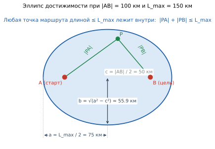
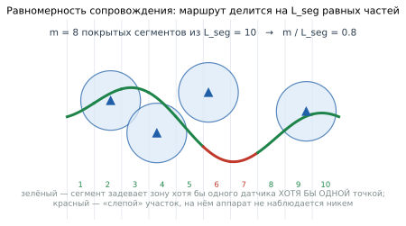
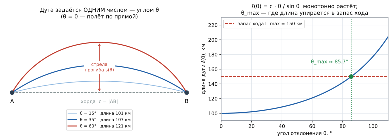
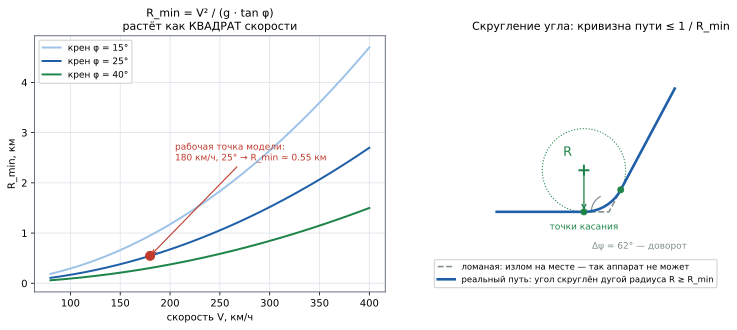
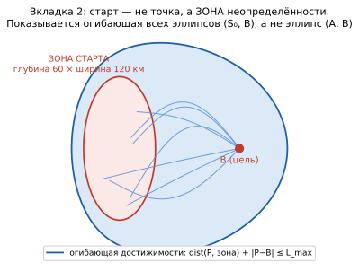

# Обзор: размещение датчиков при известном направлении полёта (вкладки 1 и 2)

> **Учебное пособие.** Часть 3 из 4. Общая теория — [часть 1](1_ТЕОРИЯ_ОПТИМИЗАЦИИ.md),
> язык записи и геометрия — [часть 2](2_ГЕОМЕТРИЯ_И_ОБОЗНАЧЕНИЯ.md).

**Порядок изложения — канонический для научной работы** (§9 части 1): сначала
содержательная постановка словами, затем формализованная в обозначениях.

| Разделы | О чём |
|---|---|
| §0 | введение: актуальность, цель и задачи, объект и предмет |
| §1 | **все переменные с расшифровкой — до первой формулы** |
| §2–§3 | вербальная постановка, допущения, класс задачи и выбор аппарата |
| §4 | математическая постановка: область, обнаружение, полезность, критерий |
| §5–§6 | модели движения аппарата и модель появления старта |
| §7 | метод решения: дискретизация, субмодулярность, жадный выбор, SAA |
| §8–§9 | показатели качества и результаты контрольного прогона |
| §10–§11 | соответствие «формула → код», ограничения модели и развитие |

---

<!-- ОГЛАВЛЕНИЕ · сгенерировано tools/переносимое/docmap.py — руками не править -->
> **Оглавление** — номер строки · раздел. Открывать нужный раздел, а не файл
> целиком (`Read` с `offset`). Пересобрать: `python tools/переносимое/docmap.py`.
>
> `  83` 0. Введение
>   `  85` 0.1. Актуальность
>   `  98` 0.2. Цель и задачи
>   ` 113` 0.3. Объект и предмет
>   ` 119` 0.4. Две постановки — две вкладки
> ` 133` 1. Переменные и обозначения
>   ` 137` 1.1. Исходные данные (задаются пользователем)
>   ` 158` 1.2. Вычисляемые величины
>   ` 168` 1.3. Переменные решения и функции
> ` 183` 2. Содержательная постановка
>   ` 185` 2.1. Вербально
>   ` 204` 2.2. Зафиксированные допущения
> ` 223` 3. Класс задачи и выбор математического аппарата
>   ` 225` 3.1. К какому классу относится задача
>   ` 239` 3.2. Отвергнутая игровая постановка
>   ` 250` 3.3. Отвергнутые метаэвристики
> ` 259` 4. Математическая постановка
>   ` 261` 4.1. Область достижимости
>   ` 278` 4.2. Модель обнаружения и кратность
>   ` 299` 4.3. Равномерность через сегментацию
>   ` 324` 4.4. Функция полезности
>   ` 347` 4.5. Критерий оптимизации и переход к выборке
>   ` 369` 4.6. Ограничения на позиции датчиков
> ` 395` 5. Модели движения аппарата
>   ` 397` 5.1. Общая схема
>   ` 412` 5.2. Дуга по углу отклонения (вкладка 1, этап 1)
>   ` 435` 5.3. Петля / змейка (вкладка 1, этап 2)
>   ` 450` 5.4. Манёвр «по точкам» — главная модель
>   ` 504` 5.5. Манёвр «по синусу» — альтернативный закон
>   ` 522` 5.6. Модели вкладки 2
>   ` 530` 5.7. Физика полёта как ограничение
> ` 552` 6. Модель появления старта
>   ` 554` 6.1. Вкладка 1 — точка
>   ` 558` 6.2. Вкладка 2 — зона неопределённости
> ` 604` 7. Метод решения
>   ` 606` 7.1. Дискретизация
>   ` 613` 7.2. Субмодулярность целевой функции
>   ` 627` 7.3. Жадный алгоритм и гарантия
>   ` 653` 7.4. Инкрементальный SAA
>   ` 665` 7.5. Вторичный критерий
>   ` 679` 7.6. Структура данных
> ` 699` 8. Показатели качества
> ` 716` 9. Результаты контрольного прогона
>   ` 723` 9.1. Модель движения «дуги» (144 кандидатных позиции)
>   ` 731` 9.2. Модель движения «манёвр» (229 кандидатных позиций)
>   ` 739` 9.3. Что из этого следует
> ` 763` 10. Реализация
>   ` 768` 10.1. Соответствие «формула → код»
>   ` 799` 10.2. Режимы работы
>   ` 808` 10.3. Проверка входных данных
> ` 816` 11. Ограничения модели и направления развития
>   ` 818` 11.1. Честные ограничения
>   ` 828` 11.2. Куда развивать
> ` 846` Источники
> ` 862` Что дальше
<!-- /ОГЛАВЛЕНИЕ -->

## 0. Введение

### 0.1. Актуальность

Число коммерческих беспилотных аппаратов самолётного типа — курьерских,
аэрофотосъёмочных, агродронов — растёт быстрее, чем средства контроля воздушного
пространства. Задача мониторинга состоит не в том, чтобы поставить датчики «везде»
(это невозможно по стоимости), а в том, чтобы **ограниченным числом датчиков
получить максимально надёжное наблюдение**.

Расстановка «на глаз» неэффективна по двум причинам: человек не удерживает во
внимании перекрытие зон и систематически переоценивает пользу датчика, поставленного
рядом с уже существующим (это ровно то, что формализуется субмодулярностью,
[часть 1 §4.3](1_ТЕОРИЯ_ОПТИМИЗАЦИИ.md)). Задача решается численно.

### 0.2. Цель и задачи

**Цель.** Определить расстановку `N` наземных датчиков обнаружения, обеспечивающую
максимальное качество наблюдения за аппаратом, летящим из района старта в известную
цель, при заранее неизвестном точном маршруте.

| № | Задача | Результат |
|---|---|---|
| 1 | формализовать «правдоподобный маршрут» при неизвестной траектории | набор стохастических моделей движения с ограничением по запасу хода и физике полёта |
| 2 | построить меру качества наблюдения | функция полезности `φ(S, γ)` с насыщением по кратности и учётом равномерности |
| 3 | свести стохастическую задачу к вычислимой | выборочное среднее `F_t(S)` (SAA) |
| 4 | свести непрерывную задачу к дискретной | сетка кандидатных позиций, ограниченная коридором |
| 5 | выбрать метод с гарантией качества | жадный субмодулярный выбор, оценка `(1 − 1/e)` |
| 6 | обеспечить воспроизводимость | фиксируемое зерно ГСЧ, контрольный прогон с набором показателей |

### 0.3. Объект и предмет

**Объект исследования** — процесс обнаружения малоразмерных воздушных объектов сетью
наземных датчиков. **Предмет** — методы выбора позиций датчиков по критериям
кратности и равномерности обнаружения при стохастической неопределённости маршрута.

### 0.4. Две постановки — две вкладки

| | **Вкладка 1** | **Вкладка 2** |
|---|---|---|
| точка старта | известна точно: `A` | известна приблизительно: **зона** вокруг `A` |
| цель | известна: `B` | известна: `B` |
| область достижимости | эллипс с фокусами `A`, `B` | огибающая эллипсов `(S₀, B)` |
| дополнительные ограничения | датчики не за целью | плюс: не в зоне старта и не за её спиной |

Математическое ядро у обеих постановок **одно и то же** — различается только модель
появления старта. Общая часть вынесена в базовый класс `RouteModelBase`.

---

## 1. Переменные и обозначения

Все величины, встречающиеся ниже, — до первой формулы.

### 1.1. Исходные данные (задаются пользователем)

| Символ | В коде | Что это | Умолчание |
|---|---|---|---|
| `\|AB\|` | `ab_distance` | расстояние от старта до цели, км | 100 |
| `L_max` | `L_max` | **запас хода** — предельная длина маршрута, км | 150 |
| `N` | `N` | число датчиков (фиксированный ресурс) | 6 |
| `R` | `R` | радиус обнаружения датчика, км | 12 |
| `k` | `k` | требуемая **кратность** — минимум различных засечек | 3 |
| `L_seg` | `L_seg` | на сколько равных сегментов делится маршрут | 10 |
| `V` | `speed_kmh` | крейсерская скорость аппарата, км/ч | 180 |
| `φ_кр` | `bank_deg` | максимальный угол крена, ° | 25 |
| `n_min…n_max` | `n_min`, `n_max` | диапазон числа путевых точек маршрута | 2…5 |
| `depth` | `corridor_depth` | глубина зоны старта вдоль оси `A→B`, км (вкл. 2) | 60 |
| `width` | `corridor_width` | ширина зоны старта поперёк оси, км (вкл. 2) | 120 |
| `T` | `T` | число итераций накопления выборки | 400 |
| `step` | `grid_step` | шаг сетки кандидатных позиций, км | 7 |
| `σ_frac` | `sigma_frac` | ширина пучка как доля предельного угла | 0.45 |
| `n_points` | `n_points` | число точек дискретизации маршрута | 140 |
| — | `seed` | зерно генератора случайных чисел | `None` (случайно) |

### 1.2. Вычисляемые величины

| Символ | Что это | Формула |
|---|---|---|
| `a`, `b`, `c` | полуоси и фокальное расстояние эллипса достижимости | `a = L_max/2`, `c = \|AB\|/2`, `b = √(a²−c²)` |
| `E` | эллипс достижимости | `{ P : \|PA\| + \|PB\| ≤ L_max }` |
| `θ_max` | предельный угол отклонения дуги | корень `ℓ(θ) = L_max` |
| `R_min` | минимальный радиус разворота, км | `V² / (g · tan φ_кр)` |
| `C` | множество кандидатных позиций после фильтров | сетка ∩ коридор |

### 1.3. Переменные решения и функции

| Символ | Что это |
|---|---|
| `S = {s₁ … s_N}` | **переменные решения**: позиции датчиков, `s_j ∈ ℝ²` |
| `Γ` / `γ` | случайный маршрут / его конкретная реализация |
| `n(S, γ)` | кратность — число **различных** датчиков, засёкших маршрут |
| `m(S, γ)` | число покрытых сегментов из `L_seg` |
| `c(S, γ)` | непрерывное покрытие — доля длины пути под наблюдением |
| `φ(S, γ)` | полезность расстановки `S` на маршруте `γ` |
| `α₁, α₂` | веса критериев кратности и равномерности, `α₁ + α₂ = 1` |
| `F(S)` / `F_t(S)` | целевая функция: истинная / оценённая по выборке из `t` маршрутов |

---

## 2. Содержательная постановка

### 2.1. Вербально

На плоскости заданы район старта и цель. Беспилотный аппарат самолётного типа
перемещается от старта к цели, располагая **ограниченным запасом хода** `L_max`.
Из-за этого ограничения существует бесконечное множество допустимых траекторий,
каждая из которых лежит внутри области достижимости.

Точный маршрут заранее неизвестен: аппарат может идти по прямой, отклоняться дугой,
маневрировать ломаной или змейкой — в пределах запаса хода. Требуется расставить `N`
датчиков с радиусом действия `R` так, чтобы на **типичном** маршруте:

* **обнаруживать аппарат кратно** — не менее `k` раз различными датчиками
  (критерий пересечения: одна засечка может оказаться ложной или пропущенной);
* **вести его равномерно вдоль всего пути** — засечки распределены по маршруту, а не
  сгруппированы на одном участке (критерий распределения, он же сопровождение).

Поскольку маршрут случаен, задача **стохастическая**: оптимизируется математическое
ожидание полезности по распределению маршрутов.

### 2.2. Зафиксированные допущения

Их следует проговорить явно — они определяют границы применимости результата.

| Допущение | Формулировка | Следствие |
|---|---|---|
| **геометрия** | задача двумерная | высота полёта не моделируется |
| **обнаружение** | бинарное: факт входа в круг радиуса `R` | нет вероятности обнаружения, нет зависимости от дальности |
| **повторный вход** | не учитывается | важен факт «датчик видел», а не сколько раз |
| **противник** | не моделируется | маршруты **не подстраиваются** под расстановку датчиков |
| **равнозначность** | кратность и равномерность считаются сопоставимыми | сведение к одному критерию весами законно |
| **стоимость** | все позиции равноценны | задача «выбрать `N` штук», а не бюджетная |

⚠️ **Ключевое допущение — отсутствие противодействия.** Выборка маршрутов служит
исключительно для описания **наиболее вероятных направлений движения**. Именно оно
делает законной вероятностную постановку вместо минимаксной (§3.2).

---

## 3. Класс задачи и выбор математического аппарата

### 3.1. К какому классу относится задача

В точной постановке задача принадлежит классу **k-барьерного покрытия**
(k-barrier coverage), введённому Kumar, Lai, Arora (2007): каждый пересекающий
контролируемый сектор объект должен быть обнаружен не менее чем `k` различными
датчиками. Это прямой аналог требования минимальной кратности засечек.

Дискретная форма выбора позиций опирается на **задачу максимального покрытия
размещением** (Maximal Covering Location Problem, MCLP; Church, ReVelle, 1974) —
выбрать позиции, максимизирующие долю покрытых объектов.

По классификации [части 1 §3](1_ТЕОРИЯ_ОПТИМИЗАЦИИ.md) задача одновременно:
**дискретная**, **стохастическая**, **многокритериальная**, **NP-трудная**.

### 3.2. Отвергнутая игровая постановка

Рассматривалась и была отвергнута постановка с противодействующим противником: метод
двойного оракула (double oracle), фиктивная игра (fictitious play), игры безопасности
типа Штакельберга, путь наименьшей экспозиции как наихудший маршрут.

**Основание для отказа.** Маршруты порождаются случайно из заданного распределения и
не подстраиваются под расположение датчиков; рациональный игрок-противник не
моделируется. Применение минимаксного аппарата к задаче без противодействия дало бы
систематически пессимистичную и неинформативную расстановку.

### 3.3. Отвергнутые метаэвристики

Метод роя частиц (PSO), генетические алгоритмы на данном этапе не применяются.
**Основание:** целевая функция обладает субмодулярностью, а значит доступен метод с
**доказанной нижней оценкой качества** (§7.3). Метаэвристики такой оценки не дают и
требуют эвристической настройки, что ухудшает воспроизводимость.

---

## 4. Математическая постановка

### 4.1. Область достижимости



```
E = { P : |PA| + |PB| ≤ L_max },     a = L_max/2,  c = |AB|/2,  b = √(a² − c²)     (1)
```

* `P` — произвольная точка плоскости;
* `|PA|`, `|PB|` — расстояния от неё до старта и до цели;
* `L_max` — запас хода;
* `a` — большая полуось, `c` — фокальное расстояние, `b` — малая полуось.

**Смысл.** Ограничение по запасу хода **автоматически** удерживает весь маршрут
внутри `E`, поэтому отдельная проверка «не вышли за дальность» в цикле не нужна.
Доказательство и пример расчёта — [часть 2 §4.2](2_ГЕОМЕТРИЯ_И_ОБОЗНАЧЕНИЯ.md).

### 4.2. Модель обнаружения и кратность

Зона обнаружения датчика `s` — круг: `D(s) = { x : |x − s| ≤ R }`.

**Обнаружение** засчитывается как однократный факт входа маршрута в зону датчика;
повторный вход того же датчика не учитывается. Отсюда кратность:

```
n(S, γ) = #{ j : min_t |γ(t) − s_j| ≤ R }                                          (2)
```

* `#{…}` — число элементов, удовлетворяющих условию;
* `j` — номер датчика, `s_j` — его позиция;
* `γ(t)` — точки маршрута (маршрут дискретизирован `n_points` точками);
* `min_t |γ(t) − s_j|` — наименьшее расстояние от маршрута до датчика `j`;
* условие `≤ R` — маршрут хотя бы раз вошёл в зону этого датчика.

> 📐 **Важное свойство.** Функция `n(S, γ)` **аддитивна (модулярна)** по `S`: вклад
> каждого датчика не зависит от остальных. Это свойство — фундамент дальнейшего
> обоснования субмодулярности (§7.2).

### 4.3. Равномерность через сегментацию



Маршрут делится на `L_seg` сегментов равной длины; считается число покрытых:

```
m(S, γ) = #{ сегментов, задевающих зону хотя бы одного датчика }                   (3)
```

**Зачем сегментация.** Она реализует требование равномерности **напрямую**:
непокрытые сегменты в конце маршрута снижают показатель, что вытесняет концентрацию
засечек в начале траектории. Альтернатива — штрафовать «сгустки» датчиков — работала
бы косвенно и требовала подбора штрафа.

Отдельно вводится **непрерывное покрытие**:

```
c(S, γ) = (длина пути под наблюдением) / (полная длина пути)                       (4)
```

Оно отвечает на вопрос «какую долю пути аппарат ведётся» и отличается от дискретного
счёта засечек. ⚠️ `c` — **показатель**, а не критерий: в целевую функцию не входит
(см. [часть 1 §2.1](1_ТЕОРИЯ_ОПТИМИЗАЦИИ.md)).

### 4.4. Функция полезности

```
φ(S, γ) = α₁ · min( n(S,γ), k ) / k  +  α₂ · m(S,γ) / L_seg                        (5)
```


* `min(n, k)/k ∈ [0, 1]` — **нормированная кратность с насыщением**: засечки сверх
  `k` не вознаграждаются, и ресурс переносится на необеспеченные маршруты;
* `m/L_seg ∈ [0, 1]` — доля покрытых сегментов;
* `α₁` — вес критерия пересечения (кратности), `α₂` — распределения (равномерности),
  `α₁ + α₂ = 1`;
* итог `φ ∈ [0, 1]`, что делает значения разных прогонов сравнимыми.

**Три режима оптимизации** — три точки на границе Парето:

| Режим | В коде | `α₁` | `α₂` | Когда применять |
|---|---|---|---|---|
| распределение | `distribution` | 0.25 | 0.75 | важно вести по всему пути |
| пересечение | `crossing` | 0.75 | 0.25 | важна надёжность факта засечки |
| сбалансированный | `balanced` | 0.50 | 0.50 | компромисс (по умолчанию) |

### 4.5. Критерий оптимизации и переход к выборке

Истинный критерий — математическое ожидание полезности:

```
F(S) = 𝔼_Γ[ φ(S, Γ) ] → max,      при |S| = N                                      (6)
```

Распределение `Γ` задано **неявно** (алгоритмом порождения маршрутов), формулы для
`𝔼[φ]` не существует. Поэтому применяется **метод выборочного среднего** (SAA):

```
F_t(S) = (1/t) · Σ_{i=1..t} φ(S, γᵢ) → max,     S_t = argmax F_t(S)                (7)
```

* `t` — размер накопленной выборки (он же номер итерации);
* `γᵢ` — `i`-й порождённый маршрут;
* `argmax` — та расстановка, на которой максимум достигается.

При `t → ∞` имеем `F_t → F` по закону больших чисел, поэтому решение SAA сходится к
решению исходной стохастической задачи. Подробно — [часть 1 §7](1_ТЕОРИЯ_ОПТИМИЗАЦИИ.md).

### 4.6. Ограничения на позиции датчиков

| № | Ограничение | Формула | Тип |
|---|---|---|---|
| 1 | внутри коридора движения | `P ∈ коридор` | жёсткое |
| 2 | не за целью `B` | `(P − A) · û ≤ \|AB\|` | жёсткое |
| 3 | не внутри зоны старта (вкл. 2) | нарушение неравенства (8) | жёсткое |
| 4 | не за спиной у зоны старта (вкл. 2) | `(P − A) · û ≥ −depth/2` | жёсткое |
| 5 | развязка от якоря | `\|P − якорь\| ≥ 1.35·R` | жёсткое |

**Обоснование каждого:**

1. Точки эллипса вне коридора недостижимы маршрутами — датчик там бесполезен
   ([часть 2 §4.3](2_ГЕОМЕТРИЯ_И_ОБОЗНАЧЕНИЯ.md));
2. маршруты заканчиваются в `B`; позиции за целью давали «кучу» позади цели;
3. и 4. в районе предполагаемого пуска и позади него свои датчики не размещают —
   допустимо только полупространство в сторону цели;
5. кандидаты ближе `1.35·R` к якорному датчику исключаются: перекрытие зон
   ограничивается ≈ 12 % ([расчёт — часть 2 §9.1](2_ГЕОМЕТРИЯ_И_ОБОЗНАЧЕНИЯ.md)).

**Якорный датчик.** Первым принудительно ставится датчик у цели: центр в
`B − (2/3)R·ê∥`, так что зона на `1/3 R` заходит за `B` — рубеж оказывается
непосредственно у цели.

---

## 5. Модели движения аппарата

### 5.1. Общая схема

Маршрут — массив `n_points` точек от старта к `B`. **Профиль разброса** задаёт
амплитуду отклонения от прямой (а **не** число точек — частая путаница):

| Профиль | В коде | Поведение |
|---|---|---|
| малый | `normal` | маршрут жмётся к прямой `A→B` |
| средний | `mixed` | умеренное отклонение (по умолчанию) |
| сложный | `complex` | к краям эллипса, заход с разных направлений |
| смешанный | `balanced` | случайный выбор одного из трёх на каждой итерации |

⚠️ Из-за режима «смешанный» в выборке встречаются и почти прямые маршруты — это не
дефект, а заложенное разнообразие.

### 5.2. Дуга по углу отклонения (вкладка 1, этап 1)



Дуга окружности `A→B`, заданная знаковым касательно-хордовым углом `θ`:

```
длина дуги     ℓ(θ) = c_len · θ / sin θ                                            (9)
радиус дуги    R_arc = c_len / (2 · sin θ)
предельный угол θ_max:   ℓ(θ_max) = L_max      (бинарный поиск)
```

* `c_len = |AB|` — длина хорды;
* `θ` — угол между хордой и касательной в точке `A`, **в радианах**;
* `θ = 0` — прямая; рост `|θ|` — дуга длиннее и круче; знак задаёт сторону.

**Выбор угла по профилю:**

* `normal` — усечённое нормальное `N(0, σ)`, где `σ = σ_frac · θ_max` — короткий путь
  чаще, предельные дуги редки;
* `mixed` — равномерно на `[−θ_max, θ_max]`;
* `complex` — тяготеет к `±θ_max` (сильно выгнутые обходные дуги).

### 5.3. Петля / змейка (вкладка 1, этап 2)

Синусоида с закреплёнными концами:

```
y(t) = amp · sin(πt) · sin(π · n_lobes · t + ph),      t ∈ [0, 1]                  (10)
```

* `t` — доля пути от 0 до 1;
* `amp` — амплитуда петли, выбирается по профилю в пределах `amp_max`;
* `n_lobes` — число лепестков, `ph` — фаза;
* `sin(πt)` — **огибающая**, обращающаяся в ноль на обоих концах: она и закрепляет
  маршрут в `A` и `B`;
* `amp_max` подбирается так, чтобы длина равнялась `L_max` — прямой аналог `θ_max`.

### 5.4. Манёвр «по точкам» — главная модель

Маршрут самолётного типа: старт → путевые точки → цель, звенья соединены, углы
скруглены дугами радиуса `≥ R_min`. Модель ближе к натуре, чем гладкая синусоида:
реальные маршруты — ломаные с плавными доворотами.

**Число точек** — случайно в диапазоне `[n_min, n_max]`, но не больше физического
предела `D / (4·R_min)`, где `D` — расстояние от старта до цели.

**Продольное положение точки** — стратификация по доле пути со случайным сдвигом
(чтобы расстояния между точками были неравномерными):

```
frac_i = clip( s_lo + (0.95 − s_lo)·(i + 1 + ξ)/(n + 1),  s_lo,  0.95 )           (11)
s_i    = frac_i · D,        ξ ~ U(−0.35, 0.35)
```

* `i` — номер точки, `n` — их общее число;
* `ξ` («кси») — случайный сдвиг внутри страты;
* `s_lo` — нижняя граница доступного диапазона (см. §6.2);
* `clip` — ограничение значения диапазоном.

**Боковой вынос точки** — «линза», нулевая на концах:

```
b     = √( (L_max/2)² − (|S₀B|/2)² )                                              (12а)
x_i   = (frac_i − s_lo) / (1 − s_lo)                                              (12б)
h_i   = sign_i · u · ρ · b · 4 · x_i · (1 − x_i)                                  (12в)
```

* `b` — **максимально достижимый боковой вынос**: полу-малая ось эллипса `S₀↔B`;
* `ρ` («ро») — амплитуда как **доля** от `b`, по профилю: малый ≈ 0.08–0.25,
  средний ≈ 0.32–0.62, сложный ≈ 0.70–1.05;
* `x_i` — доля внутри доступного диапазона;
* `u ~ U(u_min, 1)` — доля выноса (в сложном профиле `u_min ≈ 0.90`);
* `4·x·(1−x)` — форма линзы: ноль на концах, максимум посередине;
* `sign_i` — сторона отклонения.

⚠️ **Почему база — `b`, а не хорда `D`.** Если брать амплитуду как долю от `D`,
маршрут регулярно превышает `L_max`, и последующая «укладка в запас хода» схлопывает
его в прямую линию. База на `b` гарантирует, что вынос помещается в запас хода.

**Форма отклонения в сложном профиле** — не частый зигзаг, а **1–2 крупных лепестка**:
узкий зигзаг при многих точках не успевает уйти от центра в пределах `L_max`. Разные
маршруты выбирают разную сторону, поэтому выборка заполняет эллипс с разных
направлений.

**Скругление углов.** В вершине с доворотом `Δψ` строится дуга радиуса
`R = T / tan(Δψ/2)`, где `T = turn_frac · min(ℓ_вх, ℓ_вых)`, но не меньше `R_min`.
Между дугами — прямые участки, кривизна везде `≤ 1/R_min`.

**Укладка в запас хода.** Если длина превысила `L_max`, амплитуда выноса плавно
уменьшается (масштаб `1.0 → … → 0.0`), пока длина не уложится.

### 5.5. Манёвр «по синусу» — альтернативный закон

Боковое отклонение как сумма гармоник — гладкая волна без прямых участков:

```
lat(t) = Σ_{j=1..lobes} a_j · sin(jπt),        t ∈ [0, 1]                         (13)
```

Учёт `R_min`: кривизна гармоники `a_j·sin(jπx/D)` оценивается как `|a_j|·(jπ/D)²`,
и суммарная ограничивается сверху:

```
Σ_j |a_j| · (jπ/D)²  ≤  1/R_min ;   если превышено — все a_j умножаются на
f = (1/R_min) / Σ(…)                                                              (14)
```

Так синусоидальный манёвр не закладывает виражи круче физически возможных.

### 5.6. Модели вкладки 2

| Модель | В коде | Отличие |
|---|---|---|
| дуга из старта | `area_arc` | та же дуга (5.2), но из случайной точки `S₀` в `B` |
| ломаная | `polyline` | путь по точкам (5.4), но **без** скругления углов |
| манёвр | `maneuver` | полный вариант со скруглением |

### 5.7. Физика полёта как ограничение



```
R_min = V² / ( g · tan φ_кр )                                                     (15)
```

* `V` — путевая скорость, м/с (в интерфейсе вводится в км/ч);
* `φ_кр` — максимальный угол крена, радианы (в интерфейсе — градусы);
* `g = 9.81 м/с²`.

> 🧮 **Пример расчёта.** При `V = 180 км/ч = 50 м/с` и `φ_кр = 25°`:
> `R_min = 2500 / (9.81 · 0.4663) ≈ 546 м ≈ 0.55 км`.

**Смысл:** кривизна любого манёвра ограничена `κ ≤ 1/R_min`. На картах в сотни
километров это ограничение почти не «связывает», но оно физически корректно и
страхует от нереалистичных резких манёвров. Крен и скорость — характеристики
аппарата, задаются пользователем.

---

## 6. Модель появления старта

### 6.1. Вкладка 1 — точка

Старт фиксирован: все маршруты начинаются в `A`.

### 6.2. Вкладка 2 — зона неопределённости



Старт — эллипс неопределённости с центром `A`:

```
( (P − A)·û / (depth/2) )² + ( (P − A)·n̂ / (width/2) )² ≤ 1                       (8)
```

* `û` — орт оси `A→B`, `n̂` — перпендикуляр к ней;
* `depth` — глубина зоны (вдоль оси), `width` — ширина (поперёк);
* `depth/2`, `width/2` — полуоси эллипса зоны.

Точка старта `S₀` каждого маршрута выбирается **равномерно внутри** этого эллипса.

**Огибающая достижимости.** Маршрут из `S₀` лежит в эллипсе с фокусами `S₀`, `B` — а
не `A`, `B`. Поэтому показывается объединение всех таких эллипсов:

```
Reach = { P : dist(P, зона) + |P − B| ≤ L_max }                                   (8а)
```

Построение — [часть 2 §6.2](2_ГЕОМЕТРИЯ_И_ОБОЗНАЧЕНИЯ.md). Ни один маршрут за этот
контур не выходит.

**Где ставить путевые точки** — переключатель:

* **«в зоне старта»** (по умолчанию): `s_lo = 0.05` — точки могут появляться по всему
  пути, включая зону неопределённости; полный разброс «с первого метра»;
* **«только за зоной»**: точки ставятся за эллипсом старта, доля

```
s_lo = ( (A − S₀)·ê∥ + √[ (a·(û·ê∥))² + (b·(n̂·ê∥))² ] ) / D  + запас             (16)
```

где `a = depth/2`, `b = width/2`, `ê∥ = (B − S₀)/D` — орт направления на цель.
Формула даёт **опорную проекцию** эллипса зоны на ось `S₀→B`: точка дальше этой
проекции лежит за опорной плоскостью эллипса, и её боковой вынос (перпендикулярный
оси) не может вернуть её в зону.

Это **мягкое модельное условие** — зона старта есть область неопределённости, а не
физическое препятствие. Поэтому оно вынесено в переключатель, а не зашито жёстко.

---

## 7. Метод решения

### 7.1. Дискретизация

Непрерывная задача размещения сводится к выбору `N` позиций из конечной сетки
кандидатов `C` (равномерная сетка с шагом `grid_step`, отфильтрованная коридором и
правилами §4.6). Это превращает (7) в задачу **максимизации монотонной субмодулярной
функции при кардинальном ограничении** `|S| = N`.

### 7.2. Субмодулярность целевой функции

**Утверждение.** `F_t(S)` монотонна и субмодулярна.

**Обоснование по слагаемым:**

1. `n(S, γ)` — **модулярна** (вклады датчиков независимы, §4.2);
2. `min(·, k)` — **вогнутая неубывающая** функция;
3. композиция вогнутой неубывающей с модулярной → **монотонная субмодулярная**;
4. `m(S, γ)` — классическая **функция покрытия**, монотонная и субмодулярная
   ([доказательство — часть 1 §4.4](1_ТЕОРИЯ_ОПТИМИЗАЦИИ.md));
5. неотрицательная сумма субмодулярных (веса `α₁, α₂ ≥ 0`) субмодулярна;
6. усреднение по выборке сохраняет субмодулярность. ∎

### 7.3. Жадный алгоритм и гарантия


На каждом шаге добавляется кандидат с максимальным предельным приростом:

```
c* = argmax [ F_t(S ∪ {c}) − F_t(S) ],       c ∈ C \ S                            (17)
```

Для монотонной субмодулярной функции при кардинальном ограничении:

```
F_t(S_greedy) ≥ (1 − 1/e) · F_t(S*) ≈ 0.632 · F_t(S*)                             (18)
```

(Nemhauser, Wolsey, Fisher, 1978), где `S*` — недостижимый оптимум.

**Сравнение с точным перебором.** Число сочетаний `C(|C|, N)` растёт комбинаторно;
жадный алгоритм требует `O(N · |C| · t)` операций. При этом качество на практике —
90–95 % от оптимума при гарантированных 63 %.

**Раздельный расчёт приростов.** Прирост по кратности определяется приращением
`min(n, k)` с учётом усечения; прирост по равномерности — числом **вновь** покрытых
сегментов, вычисляемым через побитовое объединение масок.

### 7.4. Инкрементальный SAA

Расстановка пересчитывается **на каждой итерации по всей накопленной выборке**: после
первого маршрута — под один, после второго — под два, после `t`-го — под все `t`.
Структура эволюционирует и стабилизируется по мере роста выборки.

⚠️ **Принципиально: усредняется статистика маршрутов, а не координаты датчиков.**
Расстановка выводится заново как оптимум по накопленному критерию. Прямое осреднение
позиций недопустимо: среднее двух удачных расстановок бывает неудачным — два датчика,
закрывающие противоположные края сектора, при осреднении координат сходятся в центр и
не закрывают ни одного края.

### 7.5. Вторичный критерий

Когда основной критерий насыщается на малой выборке (`k` засечек и полное покрытие
сегментов достигнуты), прирост обращается в ноль у многих кандидатов сразу — то самое
«плато» из [части 1 §2.2](1_ТЕОРИЯ_ОПТИМИЗАЦИИ.md). Тогда включается **вторичный
критерий распределения** — прирост охваченной доли маршрутов по их плотности.

Выбор организован **лексикографически**: при положительном основном приросте поведение
не меняется, и свойства решения сохраняются. Оставшиеся датчики при насыщении
разносятся по самым частым путям вместо произвольного выбора.

**История правки:** в ранней реализации жадный алгоритм останавливался при нулевом
приросте, из-за чего размещались **не все** `N` датчиков. Сейчас размещаются всегда все.

### 7.6. Структура данных

`CoverageCache` хранит для каждой пары «маршрут `i` × кандидат `c`»:

| Поле | Что хранит | Для какого критерия |
|---|---|---|
| `hit[i, c]` | засекает ли датчик в `c` маршрут `i` | кратность |
| `segmask[i, c]` | битовая маска покрытых сегментов | равномерность |
| `covfrac[i, c]` | доля точек маршрута в зоне датчика | распределение |

Это позволяет оценивать предельный прирост по **всем кандидатам сразу**
векторизованно (numpy), без явных циклов. Битовые операции над масками выполняются за
один такт процессора: объединение покрытий — побитовое ИЛИ, число покрытых сегментов —
подсчёт единичных битов (popcount).

⚠️ Ограничение битовой маски `uint32` — причина требования `1 ≤ L_seg ≤ 31`,
проверяемого методом `validate()`.

---

## 8. Показатели качества

Рассчитываются по всей выборке **после** оптимизации и в целевую функцию не входят.

| Показатель | Формула | Смысл |
|---|---|---|
| средняя кратность | `𝔼[n(S, γ)]` | сколькими датчиками засекается типичный маршрут |
| покрытие пути, % | `𝔼[c(S, γ)] · 100` | какая доля пути проходит под наблюдением |
| путь вне зоны, км | `𝔼[(1 − c(S, γ)) · L(γ)]` | сколько километров аппарат не наблюдается |
| доля маршрутов с ≥ `k` | доля выборки, где `n ≥ k` | как часто требование кратности выполнено |

⚠️ Непрерывное покрытие `c` и дискретная кратность `n` считаются **раздельно**:
первое отвечает на вопрос «какую часть пути ведётся», второе — «сколькими датчиками
засечён». Разделение исключает подмену одного критерия другим при оценке качества.

---

## 9. Результаты контрольного прогона

**Условия замера:** чистые умолчания `config.Params` (`|AB|` = 100 км,
`L_max` = 150 км, `N` = 6, `R` = 12 км, `k` = 3, `L_seg` = 10, `T` = 400,
`grid_step` = 7 км, профиль «средний»), три зерна ГСЧ, три режима по одной и той же
выборке. Время прогона — доли секунды.

### 9.1. Модель движения «дуги» (144 кандидатных позиции)

| Режим | Покрытие пути, % | Ср. кратность | Вне зоны, км | Доля ≥ k, % |
|---|---|---|---|---|
| распределение | 50.4–51.9 | 3.27–3.34 | 57.1–59.0 | 81.0–89.3 |
| пересечение | 46.6–48.9 | 3.96–4.03 | 60.6–63.0 | **100.0** |
| сбалансированный | 46.6–48.9 | 3.96–4.03 | 60.6–63.0 | **100.0** |

### 9.2. Модель движения «манёвр» (229 кандидатных позиций)

| Режим | Покрытие пути, % | Ср. кратность | Вне зоны, км | Доля ≥ k, % |
|---|---|---|---|---|
| распределение | 64.0–66.1 | 4.48–4.54 | 42.7–45.9 | 99.75 |
| пересечение | 60.4–61.8 | 4.86–4.92 | 48.3–50.9 | **100.0** |
| сбалансированный | 64.0–66.0 | 4.48–4.51 | 43.0–45.9 | 99.5–99.75 |

### 9.3. Что из этого следует

1. **Режимы работают в ожидаемую сторону.** «Пересечение» даёт наибольшую кратность
   (до 4.9) и стопроцентное выполнение требования `k = 3`, но проигрывает по покрытию
   пути; «распределение» — наоборот. Это прямое подтверждение того, что веса `α₁, α₂`
   действительно управляют компромиссом, а не декоративны.
2. **Требование кратности выполняется почти всегда** — от 81 % в худшем случае до
   100 % в большинстве. Ресурса из 6 датчиков достаточно для заданной геометрии.
3. **Модель «манёвр» даёт лучшие показатели, чем «дуги».** Причина не в качестве
   расстановки, а в геометрии выборки: манёвренные маршруты держатся ближе к оси
   `A–B`, тогда как дуги расходятся веером к краям эллипса, и одним и тем же шестью
   датчиками их покрыть труднее.
4. **Совпадение режимов** («пересечение» = «сбалансированный» для дуг) — следствие
   дискретности: разные веса привели к одному и тому же набору позиций из 144
   доступных. Это нормально и указывает на устойчивость решения к весам.

⚠️ **Числа при других параметрах будут другими.** Прогон при `L_max = 130` и
`R = 14` из более раннего замера давал покрытие 75–80 % — не потому, что модель
изменилась, а потому, что больший радиус при меньшем разбросе маршрутов покрывает
путь плотнее. Любое сравнение показателей корректно **только при совпадающих
параметрах**.

---

## 10. Реализация

Архитектура — строгий **MVC**: вычислительное ядро (`model/`) не зависит от средств
отображения и работает автономно, без графического интерфейса.

### 10.1. Соответствие «формула → код»

| Что реализует | Модуль :: функция |
|---|---|
| эллипс достижимости, полуоси, авто-масштаб | `model/geometry.py` :: `ellipse_geometry` |
| перевод широты/долготы в километры | `geometry.py` :: `geo_to_local_km` |
| дуга по углу отклонения (формула 9) | `model/trajectories.py` :: `make_arc_by_angle` |
| длина дуги и предельный угол `θ_max` | `trajectories.py` :: `arc_length_from_angle`, `max_deflection_angle` |
| случайная дуга по профилю разброса | `trajectories.py` :: `sample_arc_trajectory` |
| веер вероятных дуг с пометкой крайних | `trajectories.py` :: `arc_fan` |
| коридор: контур, фильтр, габариты | `trajectories.py` :: `corridor_outline`, `corridor_filter`, `corridor_bbox` |
| петляющее движение (формула 10) | `trajectories.py` :: `make_serpentine`, `sample_serpentine_trajectory` |
| радиус разворота, скругление углов (15) | `trajectories.py` :: `turn_radius_km`, `make_arc_by_angle` |
| кратность `n(S,γ)` (формула 2) | `model/detection.py` :: `n_detections` |
| непрерывное покрытие `c(S,γ)` (4) | `detection.py` :: `continuous_coverage` |
| сегментное покрытие `m(S,γ)` (3) | `detection.py` :: `segment_coverage` |
| полезность `φ(S,γ)` (формула 5) | `detection.py` :: `utility` |
| сетка кандидатов, ограниченная коридором | `model/optimization.py` :: `candidate_grid` |
| структура покрытия (§7.6) | `optimization.py` :: `CoverageCache` |
| жадный субмодулярный выбор (17) | `optimization.py` :: `CoverageCache.greedy` |
| фильтр «не за целью» | `optimization.py` :: `filter_not_past_target` |
| общая логика вкладок 1–2 (DRY) | `model/route_model.py` :: `RouteModelBase` |
| вкладка 1: состояние и динамика SAA | `model/simulation.py` :: `SimulationModel` |
| вкладка 2: зона старта, огибающая | `model/area_start.py` |
| все параметры и режимы | `config.py` :: `Params`, `MODES` |

⚠️ **Ловушка единиц в коде.** `arc_length_from_angle` принимает угол в **радианах**,
а `make_arc_by_angle` — в **градусах**. Различие намеренное (первая — расчётная,
вторая — интерфейсная), но при правке легко перепутать: ошибка не вызовет исключения,
а тихо исказит длину.

### 10.2. Режимы работы

* **итеративный** — покадрово: пролёт аппарата вдоль маршрута при текущей расстановке,
  затем перестройка с учётом нового маршрута;
* **пакетный** (`run_batch(T)`) — полный расчёт по всей выборке сразу, с отображением
  итоговой расстановки и десяти наиболее вероятных маршрутов;
* **слои показа** — тепловая карта плотности маршрутов, 10 наиболее вероятных
  маршрутов, веер всех возможных (предельные — пунктиром).

### 10.3. Проверка входных данных

`Params.validate()` контролирует: `L_max > |AB|` (иначе цель недостижима),
`1 ≤ L_seg ≤ 31` (ограничение битовой маски), `N ≥ 1`, `k ≥ 1`, `R > 0`,
шаг угла веера `≥ 1°`.

---

## 11. Ограничения модели и направления развития

### 11.1. Честные ограничения

* **обнаружение бинарное** — круг радиуса `R` без вероятности обнаружения, без учёта
  высоты цели, рельефа в линии визирования и радиогоризонта;
* **геометрия двумерная** — высота полёта не входит в модель;
* **противник не моделируется** — маршруты не уклоняются от известных датчиков;
* **стоимость позиций одинакова** — постановка «выбрать `N` штук», не бюджетная;
* **распределение маршрутов задано моделью**, а не откалибровано по реальной
  статистике пролётов; это главный открытый вопрос.

### 11.2. Куда развивать

| Направление | Что даёт | Сохранится ли гарантия |
|---|---|---|
| вероятностная модель `P(обнаружение \| дальность)` | реалистичность вместо бинарного круга | **да** — функция останется субмодулярной |
| точное решение методом ILP при умеренной размерности | эталон для проверки жадного решения | точный оптимум |
| рекурсивное обновление (Роббинс–Монро) | плавная динамика вместо пересчёта | требует сглаживания разрывного индикатора |
| бюджетная постановка (разная цена позиций) | реалистичное планирование закупки | **да** — известен вариант жадного с той же оценкой |
| калибровка распределения маршрутов по реальным трекам | обоснованность выборки | не затрагивает метод |

⚠️ **О рекурсивном обновлении.** Факт входа в зону — **разрывная** функция положения
датчика, градиента у неё нет. Для плавного варианта индикатор пришлось бы заменить
сглаженной моделью обнаружения, убывающей с расстоянием (модель Элфеса), которая и
задавала бы направление сдвига. Для дискретного варианта с пересчётом жадным
алгоритмом это несущественно — он работает с фиксированным набором позиций.

---

## Источники

1. **Nemhauser G. L., Wolsey L. A., Fisher M. L.** An Analysis of Approximations for
   Maximizing Submodular Set Functions — I // Mathematical Programming. 1978. Vol. 14,
   № 1. P. 265–294.
2. **Kumar S., Lai T. H., Arora A.** Barrier Coverage with Wireless Sensors //
   Wireless Networks. 2007. Vol. 13, № 6. P. 817–834.
3. **Church R., ReVelle C.** The Maximal Covering Location Problem // Papers in
   Regional Science. 1974. Vol. 32, № 1. P. 101–118.
4. **Shapiro A., Dentcheva D., Ruszczyński A.** Lectures on Stochastic Programming.
   SIAM, 2009.
5. **Robbins H., Monro S.** A Stochastic Approximation Method // Annals of
   Mathematical Statistics. 1951. Vol. 22, № 3. P. 400–407.

---

## Что дальше

| Документ | О чём |
|---|---|
| [1_ТЕОРИЯ_ОПТИМИЗАЦИИ.md](1_ТЕОРИЯ_ОПТИМИЗАЦИИ.md) | критерии, целевые функции, субмодулярность, жадный алгоритм |
| [2_ГЕОМЕТРИЯ_И_ОБОЗНАЧЕНИЯ.md](2_ГЕОМЕТРИЯ_И_ОБОЗНАЧЕНИЯ.md) | словарь символов, эллипс, дуги, физика разворота |
| [4_ОБЗОР_ВКЛАДКА_3.md](4_ОБЗОР_ВКЛАДКА_3.md) | задача без известных старта и цели: весовая карта местности |
