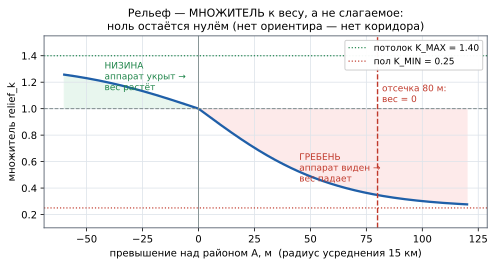

# Обзор: размещение датчиков по весовой модели местности (вкладка 3)

> **Учебное пособие.** Часть 4 из 4. Задача, в которой **ни точка вылета, ни цель не
> заданы** — известна только местность. Общая теория —
> [часть 1](1_ТЕОРИЯ_ОПТИМИЗАЦИИ.md), язык записи — [часть 2](2_ГЕОМЕТРИЯ_И_ОБОЗНАЧЕНИЯ.md),
> постановка с известным направлением — [часть 3](3_ОБЗОР_ВКЛАДКИ_1_2.md).

| Разделы | О чём |
|---|---|
| §0 | чем задача отличается от предыдущей, цель и задачи, новизна |
| §1 | **все переменные с расшифровкой — до первой формулы** |
| §2–§3 | вербальная постановка и дискретизация местности |
| §4 | модель местности: весовая функция ячейки (слои, рельеф, населённые пункты) |
| §5 | математическая постановка: две формы — по маршрутам и по взвешенным ячейкам |
| §6 | метод решения и порядок работы расстановки |
| §7 | модель порождения маршрутов: поля Дейкстры, цена шага, физика полёта |
| §8–§9 | показатели и результаты контрольного прогона |
| §10–§11 | соответствие «формула → код», честные ограничения и развитие |

---

<!-- ОГЛАВЛЕНИЕ · сгенерировано tools/переносимое/docmap.py — руками не править -->
> **Оглавление** — номер строки · раздел. Открывать нужный раздел, а не файл
> целиком (`Read` с `offset`). Пересобрать: `python tools/переносимое/docmap.py`.
>
> `  70` 0. Введение
>   `  72` 0.1. Чем эта задача отличается от предыдущей
>   `  87` 0.2. Цель и задачи
>   ` 102` 0.3. Объект, предмет, новизна
>   ` 113` 0.4. Два этапа решения
> ` 130` 1. Переменные и обозначения
>   ` 143` 1.1. Дискретизация местности
>   ` 154` 1.2. Ресурс и обнаружение
>   ` 165` 1.3. Модель местности
>   ` 178` 1.4. Порождение маршрутов
> ` 192` 2. Содержательная постановка
> ` 213` 3. Дискретизация
> ` 239` 4. Модель местности: весовая функция ячейки
>   ` 241` 4.1. Вклад линейного объекта
>   ` 262` 4.2. Веса слоёв
>   ` 284` 4.3. Рельеф
>   ` 315` 4.4. Населённые пункты
>   ` 342` 4.5. Итоговая формула веса
> ` 353` 5. Математическая постановка задачи размещения
>   ` 360` 5.1. Основная постановка: покрытие выборки маршрутов
>   ` 380` 5.2. Вырожденная постановка: покрытие взвешенных ячеек
>   ` 400` 5.3. Два критерия и ценность ячейки
>   ` 428` 5.4. Ограничения на позиции
> ` 442` 6. Метод решения
>   ` 444` 6.1. Почему не точный перебор
>   ` 449` 6.2. Субмодулярность и гарантия
>   ` 477` 6.3. Два режима расстановки и порядок работы
>   ` 522` 6.4. Структура данных
> ` 536` 7. Модель порождения маршрутов
>   ` 540` 7.1. Область достижимости
>   ` 553` 7.2. Цена шага
>   ` 576` 7.3. Стохастический выбор следующей ячейки
>   ` 603` 7.4. Физика полёта как ограничение построения
> ` 628` 8. Показатели качества
> ` 642` 9. Результаты контрольного прогона
> ` 671` 10. Реализация
> ` 700` 11. Что проговорить в статье отдельно
>   ` 702` 11.1. Сильные стороны постановки
>   ` 710` 11.2. Честные ограничения
>   ` 723` 11.3. Куда развивать
> ` 734` Источники
> ` 750` Что дальше
<!-- /ОГЛАВЛЕНИЕ -->

## 0. Введение

### 0.1. Чем эта задача отличается от предыдущей

В частях 1–3 разбиралась постановка, где направление полёта известно: есть старт и
есть цель, неизвестен лишь конкретный маршрут между ними. Здесь снимается и это:

| | Вкладки 1–2 | **Вкладка 3** |
|---|---|---|
| точка вылета | известна (точно или как зона) | **не задана** |
| цель | известна | **не задана** |
| что известно | геометрия `A`, `B`, запас хода | **только местность** |
| откуда берётся выборка маршрутов | геометрические модели движения | блуждание по весовой карте местности |

**Практический смысл.** Задача мониторинга района, а не конкретного направления:
требуется прикрыть участок местности, не зная, откуда и куда полетит аппарат.

### 0.2. Цель и задачи

**Цель.** Определить размещение ограниченного числа наземных датчиков обнаружения,
дающее максимальное покрытие вероятных траекторий над заданным участком местности —
при отсутствии сведений о точке вылета и цели полёта.

| № | Задача | Результат |
|---|---|---|
| 1 | формализовать «правдоподобность пролёта» через характеристики местности | весовая функция ячейки по данным OpenStreetMap и цифровой модели рельефа |
| 2 | свести непрерывную задачу к дискретной | сетка ячеек 500 м и сетка кандидатных позиций с шагом `R`/2 |
| 3 | построить целевую функцию покрытия с насыщением по кратности | `F(S)` — монотонная субмодулярная функция |
| 4 | выбрать метод оптимизации с гарантией качества | жадный алгоритм, оценка `(1 − 1/e)` |
| 5 | задать физически осмысленные ограничения на позиции | запрет воды, минимальный разнос, отсечение бесполезных позиций |
| 6 | обеспечить воспроизводимость | эталонный прогон с зафиксированным набором показателей |

### 0.3. Объект, предмет, новизна

**Объект** — процесс обнаружения малоразмерных воздушных объектов сетью наземных
датчиков. **Предмет** — методы выбора позиций датчиков по критерию покрытия вероятных
траекторий.

**Научная новизна постановки** — не в самом жадном алгоритме (он классический), а в
**способе получения входных данных**: вероятная область пролёта строится по открытым
геоданным местности, без обучающей выборки реальных треков, которой для гражданских
беспилотных аппаратов в открытом доступе нет.

### 0.4. Два этапа решения

Задача распадается на два этапа, и второй опирается на первый:

```
① по цифровой карте местности строится ВЕСОВАЯ СЕТКА
   оценка того, где пролёт правдоподобен
   (реки, дороги, ЛЭП — ориентиры; города и высоты — препятствия)
                    │
                    ▼
② по этой сетке решается ЗАДАЧА ПОКРЫТИЯ
   выбрать N позиций, максимизирующих покрытый вес
   с насыщением по кратности и распределённостью по площади
```

---

## 1. Переменные и обозначения

> ⚠️ **Все числовые значения в этом документе сняты на участке «Северодонецк →
> Луганск»** (94 × 75 км) — на нём делались все замеры пособия. С 29.08.2026 в программе
> активен другой участок, «Плесецк — Мирный» (77 × 59 км, 154 × 119 = 18 326 ячеек,
> 3 283 кандидата), и абсолютные числа там иные; формулы, обозначения и выводы от этого
> не зависят. Прежний участок остался рабочим — переключается строкой `THREAT_AREA`,
> см. [ОГРАНИЧЕНИЯ 5.1](../ОГРАНИЧЕНИЯ.md).
>
> Умолчания тоже сдвинулись: `threat_N` = 20 (было 15), добавлен второй тип датчиков
> (`threat_N_big` = 3, `threat_R_big` = 15 км) —
> [МЕТОДИЧКА_ДАТЧИКИ_ДВА_ТИПА](../вкладка_3/МЕТОДИЧКА_ДАТЧИКИ_ДВА_ТИПА.md).

### 1.1. Дискретизация местности

| Символ | В коде | Что это | Значение |
|---|---|---|---|
| `e` | — | ячейка весовой сетки | — |
| `E` | — | множество всех ячеек участка | 189 × 151 = **28 539** |
| `h` | `THREAT_CELL_M` | размер ячейки, м | **500** |
| `w(e)` | `self.weight` | вес ячейки — правдоподобность пролёта | ≥ 0 |
| `C` | — | множество кандидатных позиций датчика | 4 436 |
| `step` | `threat_cand_step_km` | шаг сетки кандидатов, км | 1.0 (= `R`/2) |

### 1.2. Ресурс и обнаружение

| Символ | В коде | Что это | Умолчание |
|---|---|---|---|
| `N` | `threat_N` | число датчиков | **15** |
| `R` | `threat_R` | радиус обнаружения, км | **2.0** |
| `k` | `threat_k` | требуемая кратность | **3** |
| `S` | — | расстановка датчиков, `\|S\| = N` | — |
| `E_c` | — | ячейки, покрытые датчиком в позиции `c` | `{ e : \|e − c\| ≤ R }` |
| `cnt_S(e)` | — | сколькими датчиками покрыта ячейка `e` | — |

### 1.3. Модель местности

| Символ | В коде | Что это |
|---|---|---|
| `weight_layer` | ключ `weight` в `THREAT_LAYERS` | вес слоя (река, дорога, ЛЭП …) |
| `relief_k(e)` | `relief_k` | множитель рельефа, `[0.25, 1.40]` |
| `A`, `B` | `THREAT_DEM_AREA_KM`, `THREAT_DEM_LOCAL_KM` | превышение над районом (15 км) и окрестностью (2 км), м |
| `штраф_НП(e)` | `_village_penalty` | штраф за близость к населённому пункту |

⚠️ **Осторожно с буквами `A` и `B`.** В частях 1–3 это старт и цель; здесь — величины
превышения рельефа. Совпадение обозначений связано с тем, что оба набора взяты из
рабочего кода; в этом документе `A` и `B` означают **только превышения**.

### 1.4. Порождение маршрутов

| Символ | В коде | Что это | Значение |
|---|---|---|---|
| `gt_geo(e)` | — | поле расстояний до цели в **километрах** | — |
| `gt(e)` | — | поле расстояний в единицах **стоимости** | — |
| `Pw` | `THREAT_COST_POWER` | сила тяги по весу в цене шага | 1.0 |
| `Pr` | `THREAT_COST_RELIEF` | сила тяги по рельефу | 1.0 |
| `τ` | `_TAU_FREE`, `_TAU_TIGHT` | «температура» выбора соседа | 0.20 / 0.05 |
| `L_max` | `threat_L_max` | запас хода, км | 200 |
| `t` | `threat_iter_routes` | размер накапливаемой выборки | 150 |

---

## 2. Содержательная постановка

Задача гражданского мониторинга воздушного пространства: разместить `N` наземных
датчиков так, чтобы надёжно засекать коммерческие беспилотные аппараты самолётного
типа (курьерские, съёмочные, агродроны, нарушители зон аэропортов) при минимальном
числе датчиков.

**Исходная трудность.** Классическая постановка «перехват на известном маршруте»
здесь неприменима: маршрута нет. Требуется сначала **вывести** правдоподобные
маршруты из свойств самой местности.

**Гипотеза, на которой строится модель.** Аппарат самолётного типа при полёте вне
зоны прямой видимости оператора держится **линейных ориентиров** — рек, дорог,
железнодорожных путей, ЛЭП, лесополос: они дают привязку и упрощают навигацию.
Города аппарат обходит, возвышенности избегает — на гребне он заметнее.

⚠️ **Это именно гипотеза.** Веса слоёв заданы экспертно и не откалиброваны по
фактической статистике пролётов — главное честное ограничение работы (§11.1).

---

## 3. Дискретизация

| Объект | Дискретизация | Значение |
|---|---|---|
| местность | регулярная сетка ячеек | **500 × 500 м**; участок 94 × 75 км → **28 539** ячеек |
| позиции датчика | узлы сетки кандидатов | шаг `threat_cand_step_km`, по умолчанию **половина радиуса** |
| зона обнаружения | круг радиуса `R` | `threat_R` = **2.0 км** |

**Почему шаг кандидатов привязан к радиусу.** Если шаг крупнее зоны обзора, между
соседними кандидатами остаётся полоса шире, чем видит датчик, — лучшая точка просто
недоступна для выбора.

> 🧮 **Замер при `R` = 2 км и пяти датчиках:**
>
> | Шаг сетки | Кандидатов | Засечка | Время |
> |---|---|---|---|
> | 0.5 км | 17 847 | 96.7 % | 3.2 с |
> | **1.0 км** (`R`/2) | **4 436** | **96.7 %** | **0.8 с** |
> | 3.0 км | — | 82.7 % | — |
> | 6.0 км | — | 17.3 % | — |
>
> При `R` = 6 км разницы между шагами нет вовсе. Половина радиуса — компромисс:
> качество как у мелкой сетки при вчетверо меньшем переборе.

---

## 4. Модель местности: весовая функция ячейки

### 4.1. Вклад линейного объекта

```
вклад_слоя(e) = weight_layer · ( длина пересечения объекта с ячейкой / размер ячейки )  (1)
```

* `weight_layer` — вес слоя из таблицы §4.2;
* числитель — длина куска объекта, попавшего в ячейку, м;
* знаменатель — размер ячейки (500 м).

Величина **безразмерна**, и шкала привязана к наглядному эталону: **одно прямое
пересечение ячейки насквозь даёт ровно вес слоя**, угловой задев — малую долю, петля
внутри ячейки — чуть больше.

> ⚠️ **Почему не сумма фиксированных «плюсов» и не min-max нормировка.**
> Фиксированные плюсы смещают карту в пользу слоя, которого **просто больше по длине**
> (просёлочных дорог всегда много), а не который важнее. Min-max нормировка каждого
> слоя по всей карте перекос убирает, но требует глобального прохода и лишает единицу
> абсолютного смысла. Выбранная формула **локальна** (считается по одной ячейке),
> сохраняет эталон «пересечение ≈ вес слоя» и калибруется правкой одного числа.

### 4.2. Веса слоёв

| Слой | Вес | Слой | Вес |
|---|---|---|---|
| река / канал | 10.0 | ж/д | 8.0 |
| дорога крупная | 10.0 | ЛЭП | 5.0 |
| дорога местная | 3.0 | трубопровод | 5.0 |
| ручей | 4.0 | лесополоса | 5.0 |
| мост | 20.0 | застройка | −15.0 (репеллер) |

**Два значения понижены по замеру, а не назначены:**

* **ручей** отделён от реки: ручьёв в разы больше, и с общим весом 10 они перетягивали
  карту на себя;
* **местная дорога** снижена с 5 до 3: густая сеть просёлков давала **37 %** всего
  веса и размывала карту фоном; после правки доля **25 %**, и река, магистрали, ЛЭП
  вышли на один уровень.

**Бонус за пересечение** (`THREAT_INTERSECTION_BONUS` = 5.0): за каждый слой-аттрактор
в ячейке сверх первого прибавляется этот вес. Смысл — точки схождения ориентиров
(мост через реку, пересечение дороги и ЛЭП) заметнее и удобнее для навигации.

### 4.3. Рельеф



Множитель к весу по превышению местности в двух масштабах:

```
relief_k = 1 − 0.75·f(A / 60 м) − 0.45·f(B / 35 м),      зажат в [0.25, 1.40]      (2)
```

* `A` — превышение над **районом** (радиус усреднения 15 км): плато, гряда, общий
  подъём — «нахожусь на возвышенности вообще»;
* `B` — превышение над **окрестностью** (радиус 2 км): одиночный холм, бугор на пути;
* `f` — насыщающая функция отклика с асимметрией «вверх круче, вниз слабее»;
* 0.75 и 0.45 — силы вкладов (`THREAT_DEM_AREA_S`, `THREAT_DEM_LOCAL_S`): общий
  подъём весомее одиночного холма;
* 60 м и 35 м — уровни насыщения, при которых вклад достигает предела;
* `[0.25, 1.40]` — зажим: худшее место снижает вес вчетверо, лучшее повышает в 1.4 раза.

**Смысл:** низина поощряется (аппарат меньше виден), гребень штрафуется. Слишком
высокие места снимаются **отсечкой** полностью (`THREAT_DEM_CUT_AREA_M` = 80 м).

⚠️ **Почему множитель, а не слагаемое.** Ноль должен оставаться нулём: нет ориентира —
нет коридора. Замер на реальных данных: аддитивная схема создавала **4 982** коридора
на пустом месте (низина без ориентиров становилась «коридором») и рвала связность
карты с 68 до 148 компонент. Множитель сохраняет структуру карты точно.

**Зачем два масштаба.** Без слагаемого по району высокое открытое плато даёт
превышение ≈ 0 над своей окрестностью и не штрафуется вовсе — хотя видно оттуда на
десятки километров.

### 4.4. Населённые пункты

* **город** — пролёт запрещён, вес ячеек **обнуляется** (не уводится в минус:
  отрицательный вес делал город «ямой», от которой разбегались датчики);
* **деревня** — смягчающий штраф: −10 в центре, −5 на половине радиуса, 0 на границе,
  с **полом** `THREAT_VILLAGE_FLOOR` = 1.0: ориентир ослабляется, но не стирается.

> ⚠️ **Зачем пол штрафа.** Вес ≤ 0 в этой модели означает не «маловероятно», а
> **полный запрет** — маска проходимости берёт `weight > 0`. Штраф фиксирован (−10),
> а вес ориентиров невелик (река +10, местная дорога +3), поэтому без пола деревня
> уводила их в минус. Замер: **1 019** ячеек с ориентирами теряли коридор
> исключительно из-за штрафа, среди них **54** ячейки реки — то есть село разрывало
> коридор вдоль реки.

**Тип пункта определяется по данным участка, а не по тегу OSM.** Тег ненадёжен:
одинаковые по размеру пятна на соседних участках размечены то `village`, то `town`, а
хутор из трёх домов — как `village`. Поэтому тип пересчитывается по двум **измеримым**
признакам:

* **масштаб** — площадь застройки пятна, км²;
* **компактность** — площадь застройки / площадь замкнутого контура (0…1).

Пороги берутся не из констант, а из **распределения по рабочей области**. Требуется
согласие обоих признаков: у хутора плотность под 100 %, у растянутого вдоль трассы
города — 30 %; по одной плотности хутор ушёл бы в города, по одной площади — цепочка
сёл.

### 4.5. Итоговая формула веса

```
w(e) = [ Σ_layers вклад_слоя(e) + бонусы_пересечений ] · relief_k(e) − штраф_НП(e)  (3)
```

Порядок операций существенен: рельеф — множитель к **уже накопленному
положительному** весу, штраф населённого пункта — вычитается **после**, с полом.

---

## 5. Математическая постановка задачи размещения

Задача ставится в двух видах — по тому, что считается «покрываемым объектом».
Основной вид — покрытие **маршрутов**, вырожденный — покрытие **взвешенных ячеек**
(когда выборки маршрутов ещё нет). Оба сводятся к одной математике: максимизация
монотонной субмодулярной функции при ограничении `|S| = N`.

### 5.1. Основная постановка: покрытие выборки маршрутов

Дана выборка маршрутов `Γ = {γ₁ … γ_t}` и множество кандидатных позиций `C`.
Полезность размещения на одном маршруте — та же формула, что в частях 1 и 3:

```
φ(S, γ) = α₁ · min( n(S,γ), k ) / k  +  α₂ · m(S,γ) / L_seg                        (4)
```

* `n(S, γ)` — число **различных** датчиков, засёкших маршрут (кратность);
* `m(S, γ)` — число покрытых сегментов из `L_seg` (равномерность сопровождения);
* `min(n, k)/k` — насыщение: больше `k` засечек одного маршрута не нужно;
* `α₁, α₂` — веса критериев, `α₁ + α₂ = 1`.

Максимизируется выборочное среднее:

```
F_t(S) = (1/t) · Σ_{i=1..t} φ(S, γᵢ)  →  max,      |S| = N                         (5)
```

### 5.2. Вырожденная постановка: покрытие взвешенных ячеек

Когда выборки маршрутов нет, «покрываемым объектом» становится **ячейка карты**.

Дано: множество ячеек `E` с весами `w_e ≥ 0`, множество кандидатных позиций `C`,
радиус `R`. Каждая позиция `c ∈ C` покрывает подмножество `E_c = { e : |e − c| ≤ R }`.
Требуется выбрать `S ⊆ C`, `|S| = N`, максимизирующее покрытый вес с насыщением:

```
F(S) = Σ_{e ∈ E}  w_e · min( cnt_S(e), k ) / k  →  max                             (6)
cnt_S(e) = #{ c ∈ S : e ∈ E_c }
```

* `w_e` — вес ячейки по формуле (3);
* `cnt_S(e)` — сколькими выбранными датчиками покрыта ячейка `e`;
* `min(cnt, k)/k` — то же насыщение, что и по маршрутам.

⚠️ **Насыщение принципиально.** Без него оптимум сваливает **все** датчики на одну
самую тяжёлую клетку: без ограничения сверху выгоднее всего усиливать уже покрытое.

### 5.3. Два критерия и ценность ячейки

Реально максимизируется взвешенная сумма двух критериев:

```
φ(S) = α₁ · (кратность до k) + α₂ · (охват РАЗНЫХ ячеек),      α₁ + α₂ = 1         (7)
```

Ценность ячейки при добавлении ещё одного покрытия — то, что вычисляется в коде:

```
value(e) = α₁ · w⁺_e · [cnt < k] / k  +  α₂ · w⁺_e · [cnt < 1]  −  штраф_репеллера  (8)
Δ(c)     = Σ_{e ∈ E_c} value(e)
```

* `w⁺_e` — положительная часть веса ячейки;
* `[cnt < k]` — индикатор: 1, если ячейка ещё не набрала требуемой кратности;
* `[cnt < 1]` — индикатор: 1, если ячейка **вообще** не покрыта (за это отвечает
  второй критерий — охват новых ячеек);
* `Δ(c)` — предельный прирост кандидата `c`, вычисляется **одним матрично-векторным
  умножением**: матрица покрытия × вектор ценностей.

| Режим | `α₁` (пересечение) | `α₂` (распределение) | Смысл |
|---|---|---|---|
| распределение | 0.25 | 0.75 | равномерно по площади |
| пересечение | 0.75 | 0.25 | кратное обнаружение |
| сбалансированный | 0.50 | 0.50 | компромисс (по умолчанию) |

### 5.4. Ограничения на позиции

| Ограничение | Значение | Смысл |
|---|---|---|
| не на воде | буфер 250 м вокруг русла | датчик физически негде разместить |
| разнос между датчиками | желаемый 1.6·`R`, минимум `threat_min_sep_frac` = 0.75·`R` | перекрытие зон ограничено, датчики не кучкуются |
| «бесполезные» отсекаются | третичный ключ жадного выбора | иначе при насыщении критериев выбор брал первого кандидата по порядку массива |

⚠️ **Город датчикам не запрещён** — запрещён только водоём. Город закрыт для **пролёта
аппарата**, а не для размещения наземного оборудования; наоборот, там инфраструктура,
электропитание и связь. Смешение этих двух запретов — типичная ошибка чтения модели.

---

## 6. Метод решения

### 6.1. Почему не точный перебор

Число сочетаний `C(|C|, N)` при `|C|` = **4 436** и `N` = 15 составляет ≈ **10⁴³**
(проверено прямым расчётом). Задача **weighted maximum coverage** NP-трудна.

### 6.2. Субмодулярность и гарантия

`F(S)` **монотонна** (добавление датчика не ухудшает покрытие) и **субмодулярна** —
прирост от нового датчика убывает с ростом `S`, поскольку `min(cnt, k)` и индикатор
«ячейка ещё не покрыта» — насыщающиеся величины.

Для монотонной субмодулярной функции при кардинальном ограничении жадный алгоритм
даёт гарантию качества:

```
F(S_greedy) ≥ (1 − 1/e) · F(S*) ≈ 0.632 · F(S*)                                    (9)
```

(Nemhauser, Wolsey, Fisher, 1978), где `S*` — недостижимый оптимум. Сложность —
`O(N · |C|)` матвеков против комбинаторного перебора.

⚠️ **Оговорка о применимости.** Формула (9) требует ограничения ровно «не более `N`
позиций». Дополнительные правила из §6.3 — прежде всего **разнос** «не ближе `d` друг к
другу» — выводят задачу из условий теоремы: такое ограничение не является матроидом, и
формальной гарантии для него нет (для матроидных ограничений жадный даёт 1/2). На
практике результат остаётся высоким, потому что задача при наших параметрах «щедрая»:
потолок засечки достигается уже 12 датчиками из 20. Разбор, числа и способ вернуть
обоснованность — [планы/6_ПОПРАВКИ_В_МОДЕЛЬ_ДАТЧИКОВ.md](../архив/6_ПОПРАВКИ_В_МОДЕЛЬ_ДАТЧИКОВ.md).

> **Ключевой аргумент для статьи:** решение не эвристическое «на глаз», а с
> **доказанной нижней оценкой** качества относительно оптимума, который вычислить
> нельзя.

### 6.3. Два режима расстановки и порядок работы

Единицей покрытия может быть **маршрут** или **взвешенная ячейка**. Работают оба
режима, выбор между ними автоматический:

```
place_sensors()
├─ маршрутов < 5           → сначала построить предварительные «возможные маршруты»
├─ выборка = итерационные маршруты, если их ≥ 5; иначе предварительные
├─ выборка ≥ 5 маршрутов   → расстановка ПО МАРШРУТАМ        ← основной путь
└─ выборки нет             → расстановка ПО ВЕСОВОЙ КАРТЕ    ← запасной путь
```

**Основной режим — по выборке маршрутов** (SAA, формула 5). Он точнее, и это
**измерено**: частота пролёта под датчиком выше средней в **2.0** раза, тогда как вес
карты — лишь в **1.3** раза. Вес показывает, где местность удобна для полёта вообще;
ловить же надо конкретные пролёты.

**Три стадии по ходу работы:**

| Стадия | По чему ставятся датчики | Что происходит |
|---|---|---|
| 1. до итераций | предварительные «возможные маршруты» (строятся автоматически) | первичная расстановка по покрытию и кратности |
| 2. итерации идут | накопленные случайные маршруты, как только их ≥ 5 | расстановка **пересчитывается каждые 5** маршрутов (`THREAT_SENSOR_REFRESH_EVERY`) |
| 3. выборки нет | вся весовая карта как одна статичная «псевдотраектория» (`t` = 1) | запасной путь: единицей покрытия становится ячейка с весом |

**Сходимость видна на прогоне:** сдвиг позиций между обновлениями падает с ≈ 5 км до
нуля примерно к 30-й итерации.

**Дополнительные правила расстановки по маршрутам** (в режиме по карте их нет):

* кандидаты — только в **зоне пролёта**: там, куда БПЛА способен долететь
  вход → место → цель в пределах запаса хода. Позиция за целью допустима, если маршруты
  туда заходят;
* **якорей нет** — все позиции выбирает жадный алгоритм;
* разнос: желаемый 1.6·`R`, при нехватке позиций ослабляется до 0.75·`R`;
* датчиков **два типа**: малые (сеть по маршрутам) и большие — кольцевой щит вокруг
  цели с угловым разносом.

> ⚠️ **Изменено 29.08.2026.** Прежде кандидаты отбирались по проекции на прямую
> «вход → цель», и два датчика ставились принудительно (у входа и у цели, в ≈ 0.45·`R`
> внутрь коридора). Оба правила писались под ОДИН вход и потеряли смысл с появлением
> сектора появления из пяти точек. Разбор с замерами —
> [МЕТОДИЧКА_ДАТЧИКИ_ДВА_ТИПА §3.1](../вкладка_3/МЕТОДИЧКА_ДАТЧИКИ_ДВА_ТИПА.md).

### 6.4. Структура данных

`CoverageCache` хранит для каждой пары «кандидат × ячейка» булеву матрицу покрытия;
предельный прирост по всем кандидатам считается **одним матрично-векторным
умножением** (numpy), а не циклом. Для режима по маршрутам дополнительно хранятся
битовая маска покрытых сегментов (равномерность) и доля точек маршрута в зоне
(распределение).

**Ключевая функция — `greedy_weighted`.** Один шаг: вектор ценностей ячеек умножается
на матрицу покрытия (`Δ = A · value`), берётся максимум, выбранный кандидат исключает
соседей ближе `min_sep`, ценности пересчитываются. Шагов ровно `N`.

---

## 7. Модель порождения маршрутов

Это вход для расстановки по пролётам (§6.3, основной режим).

### 7.1. Область достижимости

Строятся **два поля Дейкстры** от цели по маске проходимых ячеек:

```
gt_geo(e) — расстояние в честных километрах  → проверка запаса хода L_max
gt(e)     — расстояние в единицах СТОИМОСТИ  → спуск при построении маршрута       (10)
```

⚠️ **Разделение принципиально.** Физику подменять нельзя: «дорогой» обход не должен
выглядеть как нехватка топлива. Маршрут спускается по стоимостному полю, но «хватит
ли хода», отбраковка и запас — всё считается по геометрическому.

### 7.2. Цена шага

```
цена(e → e′) = длина шага · (1 + Pw·(1 − w̄)) · (1 + Pr·(1 − r̄))                  (11)
```

* `w̄`, `r̄` — нормированные вес и рельеф, усреднённые по двум ячейкам (усреднение
  даёт **симметрию**: путь из `e` в `e′` стоит столько же, сколько обратно);
* `Pw` = `THREAT_COST_POWER` = 1.0, `Pr` = `THREAT_COST_RELIEF` = 1.0;
* оба сомножителя лежат в `[1, 1 + сила]`, поэтому поле остаётся в
  **километрах-эквивалентах**: «стоит как `N` км пути». Благодаря этому «температура»
  `τ` и пороги сохраняют смысл.

⚠️ **Почему два независимых множителя, а не произведение с обрезкой.** Вес отвечает на
вопрос «где есть ориентиры», рельеф — «где меня видно». При перемножении с обрезкой
единицей поощрение за низину исчезало полностью: замер давал цену 1.000 и в низине, и
на гребне — река в пойме (вес 1.0, рельеф 1.4) обрезалась ровно до того же значения,
что и река на голом плато.

> 🧮 **Замер эффекта** (250 линий, реальные данные):
> средний вес под маршрутом **11.60 → 22.42**, доля точек по пустым ячейкам
> **35.5 → 13.4 %**, длина при этом **не выросла** (102.2 → 101.7 км).

### 7.3. Стохастический выбор следующей ячейки

Маршрут строится блужданием по 8-связной сетке. Вероятность перехода в соседнюю
ячейку пропорциональна:

```
s(e′) = exp( Δgt / τ ) · corr(w(e′)) · hf(курс)                                    (12)
```

* `Δgt` — прогресс к цели (насколько сократилось расстояние по полю);
* `τ` («тау») — **температура**: `_TAU_FREE` = 0.20 при большом запасе хода,
  `_TAU_TIGHT` = 0.05 при исчерпанном — тогда аппарат идёт кратчайшим путём;
* `corr` — предпочтение по весу, размах `THREAT_WEIGHT_GAIN` = 4.0 (то есть ×41);
* `hf` — удержание курса (штраф за резкую смену направления).

**Несколько полей «жадности» вместо одного.** Если путь A дешевле B на десятки единиц,
локальная стохастика туда не уведёт: разница копится по всей длине, и все 250 линий
сливаются в одну полосу — покрытие области падало с 47 до 26 %. Поэтому каждому
маршруту достаётся своё поле из набора `THREAT_COST_MIX_STEPS` = (0, 0.35, 0.7, 1.0):
при `a ≈ 1` маршрут жмётся к коридорам, при `a ≈ 0` летит напрямик. Покрытие
вернулось к **43.1 %**.

⚠️ **Поля предрассчитываются, а не смешиваются линейно.** Смесь двух готовых полей
расстояний **полем расстояний не является**: там, где по километрам выгодно влево, а
по стоимости вправо, у смеси появляется локальный минимум-ловушка, спуск застревает и
маршрут не доходит. Замер: набиралось **128 итераций из 150** вместо 150.

### 7.4. Физика полёта как ограничение построения

```
R_min = V² / ( g · tan φ_кр )        при V = 180 км/ч, φ_кр = 25°  →  R_min ≈ 0.55 км  (13)
```

Из радиуса выведены два жёстких ограничения на выбор соседа:

| Ограничение | Значение | Обоснование |
|---|---|---|
| поворот за шаг | `TURN_MAX_DEG` = **45°** | на сетке 500 м это радиус 0.65 км — аппарат так может; 90° дало бы 0.35 км, что меньше `R_min` |
| разворот на отрезке | `TURN_WINDOW_KM` = 3 км, не круче 90° | четыре шага по 45° складываются в разворот на 180°, формально не нарушая радиуса |

Расчёт радиуса по углу поворота на сетке — [часть 2 §7.3](2_ГЕОМЕТРИЯ_И_ОБОЗНАЧЕНИЯ.md).

> 🧮 **Замер до введения ограничений:** **69 %** маршрутов имели поворот круче 90°,
> **97 %** — движение «вперёд-назад-вперёд». После: 0.7–2 % и 19–23 %.

**Сглаживание рисуемой линии.** Упрощение Дугласа–Пекера + сплайн Катмулла–Рома, с
двумя проверками: не выйти за коридор и **сохранить вес расчётной ломаной** не менее
чем на 97 %. Расчётный путь по ячейкам при этом не меняется — сглаживается только
изображение.

---

## 8. Показатели качества

```
кратность:      n(S, γ) = #{ j : min_t |γ(t) − s_j| ≤ R }
сегментное:     m(S, γ) = число покрытых сегментов из L_seg
сопровождение:  cov(S, γ) = (длина пути под наблюдением) / (длина пути)
доля ≥ k:       доля маршрутов выборки, обнаруженных не менее k раз
```

Обнаружение — факт входа маршрута в зону радиуса `R` хотя бы одного датчика;
повторный вход того же датчика не учитывается.

---

## 9. Результаты контрольного прогона

**Условия замера:** участок Северодонецк — Луганск, реальные данные OpenStreetMap,
замер при `threat_N` = 15 — умолчания того времени, один тип датчиков; **рельеф включён**
(`set_relief(True)` — при старте он выключен), время прогона ≈ 17 с.

⚠️ Прогон **не воспроизведётся на активном участке** без переключения `THREAT_AREA`
обратно на `severodonetsk` и возврата `threat_N` к 15 — см. оговорку в начале §1.

| Показатель | Значение |
|---|---|
| ячеек сетки | 28 539 (189 × 151) |
| ячеек-коридоров (вес > 0) | **11 101** |
| городская зона (запрет пролёта) | 3 441 ячейка (12.1 % участка) |
| датчиков размещено | **15 из 15** |
| датчиков на воде | **0** |
| датчиков, не ловящих ни одного пролёта | **0** |
| засечка с кратностью ≥ `k` = 3 | **98.7–100 %** (стохастика; замеры 100.0 / 98.7 / 99.3) |
| средняя кратность засечки | ≈ 6 |

**Вычислительная стоимость:** сетка 28 539 ячеек, 4 436 кандидатов, 15 датчиков —
расстановка около 1 с; полный цикл с построением карты и выборкой маршрутов ≈ 17 с.

Контроль воспроизводимости: набор эталонных чисел и порядок прогона зафиксированы в
[ОГРАНИЧЕНИЯ.md §6](../ОГРАНИЧЕНИЯ.md), сверка выполняется после каждой значимой
правки.

---

## 10. Реализация

Соответствие «формула → код». Полезно для раздела статьи о программной реализации и
для повторения результата.

| Что реализует | Модуль :: функция |
|---|---|
| сборка весовой сетки из слоёв OSM | `model/threat_grid.py` :: `build_threat_grid`, `layers_from_osm` |
| вес ячейки, наложение слоёв (формулы 1, 3) | `threat_grid.py` — `self.weight`, `self.layers` |
| множитель рельефа и отсечка (формула 2) | `threat_grid.py` :: `relief_k`, `relief_cut` |
| штраф деревни, пол штрафа | `threat_grid.py` :: `_village_penalty`, `THREAT_VILLAGE_FLOOR` |
| классификация населённых пунктов по данным | `threat_grid.py` :: `place_profiles`, `grade_places` |
| маска запрета пролёта (город, вода, рельеф) | `threat_grid.py` :: `urban_mask`, `water_mask` |
| сетка кандидатных позиций + фильтр воды | `threat_grid.py` :: `candidate_positions`, `_on_water` |
| маска проходимости | `model/threat_routes.py` :: `passable_mask` |
| область достижимости, два поля Дейкстры (10) | `threat_routes.py` :: `flight_envelope`, `build_iter_context` |
| цена шага (формула 11) | `threat_routes.py` :: `_dijkstra_cost`, `_cost_mul` |
| стохастическое блуждание (12), предел поворота | `threat_routes.py` :: `_walk_field`, `sample_one_route` |
| сглаживание линии с сохранением веса | `threat_routes.py` :: `_smooth_safe`, `_round_corners` |
| накопление выборки маршрутов | `threat_grid.py` :: `iter_batch`, `plan_routes` |
| матрица покрытия «кандидат × ячейка» | `model/optimization.py` :: `CoverageCache.set_weighted_cells` |
| **жадный выбор `N` позиций (формула 9)** | `optimization.py` :: `CoverageCache.greedy_weighted` |
| жадный выбор по выборке маршрутов | `optimization.py` :: `CoverageCache.greedy` |
| расстановка целиком, выбор источника выборки | `threat_grid.py` :: `place_sensors`, `_place_by_routes`, `_place_by_weight` |
| метрики качества расстановки | `threat_grid.py` :: `_evaluate`; `model/detection.py` |
| все параметры и режимы | `config.py` :: `Params`, константы `THREAT_*` |

---

## 11. Что проговорить в статье отдельно

### 11.1. Сильные стороны постановки

* решение с **доказанной гарантией** `(1 − 1/e)` вместо эвристики;
* **единый алгоритм для трёх разных постановок** (маршрут `A→B`, зона старта, карта
  угроз) — различается только единица покрытия: точка маршрута либо взвешенная ячейка;
* вход строится по **открытым данным** (OpenStreetMap, SRTM/Copernicus DEM), метод
  воспроизводим на любом участке.

### 11.2. Честные ограничения

* **веса слоёв заданы экспертной гипотезой** (река 10, крупная дорога 10, ж/д 8 …) и
  не откалиброваны по фактической статистике пролётов — главный открытый вопрос;
* **модель обнаружения бинарная**: круг радиуса `R` без вероятности обнаружения, без
  учёта высоты цели, рельефа в линии визирования и радиогоризонта. Физика
  радиовидимости разобрана, но в расчёт не заведена
  ([РАДИОВИДИМОСТЬ_ЗАДЕЛ.md](../вкладка_3/РАДИОВИДИМОСТЬ_ЗАДЕЛ.md));
* **планирование маршрутов сеточное** (8-связная сетка): кинематика учтена
  ограничением поворота, но не полноценной моделью движения;
* **стоимость датчиков одинакова**: задача поставлена как «выбрать `N` штук», а не как
  бюджетная оптимизация с разной ценой позиций.

### 11.3. Куда развивать

| Направление | Что даёт | Гарантия |
|---|---|---|
| калибровка весов по реальной статистике пролётов | обоснованность модели местности | не затрагивает метод |
| вероятностная модель `P(обнаружение \| дальность, высота, рельеф)` | реалистичность вместо бинарного круга | **сохранится** — `F(S)` останется субмодулярной |
| бюджетная постановка (цена позиции, лимит суммы) | реалистичное планирование закупки | **сохранится** — известен вариант жадного алгоритма |
| непрерывное планирование (Дубинс, RRT) вместо сетки | точная кинематика маршрутов | не затрагивает размещение |

---

## Источники

1. **Nemhauser G. L., Wolsey L. A., Fisher M. L.** An Analysis of Approximations for
   Maximizing Submodular Set Functions — I // Mathematical Programming. 1978. Vol. 14,
   № 1. P. 265–294.
2. **Kumar S., Lai T. H., Arora A.** Barrier Coverage with Wireless Sensors //
   Wireless Networks. 2007. Vol. 13, № 6. P. 817–834.
3. **Church R., ReVelle C.** The Maximal Covering Location Problem // Papers in
   Regional Science. 1974. Vol. 32, № 1. P. 101–118.
4. **Shapiro A., Dentcheva D., Ruszczyński A.** Lectures on Stochastic Programming.
   SIAM, 2009.
5. **Krause A., Golovin D.** Submodular Function Maximization // Tractability:
   Practical Approaches to Hard Problems. Cambridge University Press, 2014.

---

## Что дальше

| Документ | О чём |
|---|---|
| [1_ТЕОРИЯ_ОПТИМИЗАЦИИ.md](1_ТЕОРИЯ_ОПТИМИЗАЦИИ.md) | критерии, целевые функции, субмодулярность, жадный алгоритм |
| [2_ГЕОМЕТРИЯ_И_ОБОЗНАЧЕНИЯ.md](2_ГЕОМЕТРИЯ_И_ОБОЗНАЧЕНИЯ.md) | словарь символов, эллипс, дуги, физика разворота |
| [3_ОБЗОР_ВКЛАДКИ_1_2.md](3_ОБЗОР_ВКЛАДКИ_1_2.md) | постановка с известными стартом и целью |

Подробный вывод механики весов — [МЕТОДИЧКА_КАРТА_УГРОЗ.md](../вкладка_3/МЕТОДИЧКА_КАРТА_УГРОЗ.md),
действующие пороги и эталон — [ОГРАНИЧЕНИЯ.md](../ОГРАНИЧЕНИЯ.md).
